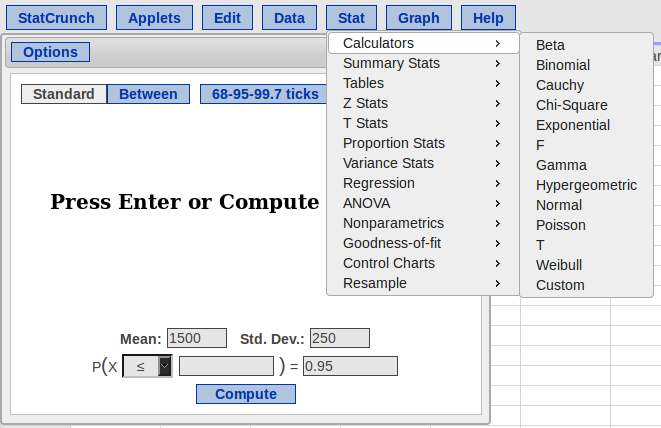
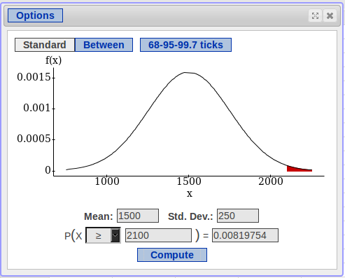
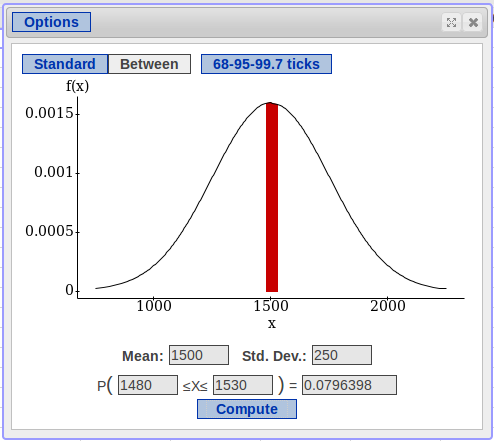

```{r global_options, include=FALSE}
knitr::opts_chunk$set(echo = FALSE, fig.width = 10, fig.height = 5, fig.align = "center", 
                      message = FALSE, warning=FALSE, cache = TRUE) 
```

## Overview

In this chapter, we will discuss:

- Standardizing Values with Z-Scores
- Shifting and Scaling Distributions
- Normal Models
- Finding Normal Percentiles
- Assessing Normality


## The Data
For this chapter, we will compare the SAT and ACT scores of 10,000 students who took both exams.  
```{r}
library(dplyr, quietly = TRUE, warn.conflicts = FALSE)
library(tidyr, quietly = TRUE, warn.conflicts = FALSE)
library(ggplot2, quietly = TRUE, warn.conflicts = FALSE)
set.seed(250)
dat <- data.frame(ID = sample(100000:999999, 10000), SAT = rnorm(10000, 1500, 250), 
                  ACT = rnorm(10000, 21, 5))
dat$SAT <- ifelse(dat$SAT > 2400, 1500, dat$SAT)
dat$ACT <- ifelse(dat$ACT > 36, 21, dat$ACT)
dat.long <- dat %>% gather(Test, Score, -ID)
head(dat)
```

## Visualizing SAT Scores
```{r}
ps <- element_text(size = 12)
ps2 <- element_text(size = 15)
ps3 <- element_text(size = 20)
this.theme <- theme(axis.title.x = ps2, axis.title.y = ps2, axis.text.x = ps, axis.text.y = ps, 
                    title = ps3,
                    legend.text = ps)
ggplot(dat, aes(x = SAT)) + geom_histogram(color = "grey80") + this.theme
```

## Visualizing ACT Scores
```{r}
ggplot(dat, aes(x = ACT)) + geom_histogram(color = "grey80") + this.theme
```

## Comparing Distributions
Both variables are unimodal and symmetric, but looking at the values we see that they both have very different scales.  

We may want to compare the distributions.  Recall that we have two main ways of doing this for numeric variables:

- Side-by-Side Histograms
- Side-by-Side Boxplots

Because the variables have very different scales, comparing them may be difficult

## Side-by-Side Histograms
```{r}
ggplot(dat.long, aes(x = Score)) + geom_histogram() + 
  this.theme +
  facet_grid(~Test)
```

## Side-by-Side Boxplots
```{r}
ggplot(dat.long, aes(x = Test, y = Score, fill = Test)) + geom_boxplot() + 
  this.theme + coord_flip()
```

## Numerical Summaries
Obviously, we can tell from the plots that the distributions are very different.  Let's look at our quantitative measures to see just how different:

```{r}
dat.split <- split(dat.long, dat.long$Test)
t(sapply(dat.split, function(l) summary(l$Score)))[,-4]
```

Because the distributions are symmetric, we can also look at the sample means and standard deviations:
```{r}
t(sapply(dat.split, function(l) data.frame(Mean = mean(l$Score), "St.Dev" = sd(l$Score))))
```

For simplicity's sake, let's call the means 1500 and 21 and the standard deviations 250 and 5, respectively.

## Standardizing with Z-Scores
What we've seen here is the problems that occur when we compare distributions with different scales.  We typically deal with this by *standardizing* our variables with *z-scores*.  

For a given distribution, we define as z-score as:

- $z = \frac{x - \bar{x}}{s}$

For our each of our students, we can find the standardized SAT and ACT scores as:

- $z_{SAT} = \frac{SAT - \overline{SAT}}{s_{SAT}} = \frac{SAT - 1500}{250}$
- $z_{ACT} = \frac{ACT - \overline{ACT}}{s_{ACT}} = \frac{ACT - 21}{5}$

## Side-by-Side Histograms of the Z-Scores
```{r}
dat2 <- data.frame(dat$ID, scale(dat[-1]))
colnames(dat2) <- c("ID", "Z.SAT", "Z.ACT")
dat2.long <- dat2 %>% gather(Test, Z.Score, -ID)
ggplot(dat2.long, aes(x = Z.Score)) + geom_histogram(color = "grey80") + 
  this.theme +
  facet_grid(~Test, scale="free")
```

## Side-by-Side Boxplots
```{r}
ggplot(dat2.long, aes(x = Test, y = Z.Score, fill = Test)) + geom_boxplot() + 
  this.theme + coord_flip()
```

## What did Standardizing Do?
To see exactly what happened, let's look at our numerical summaries.

Five Number Summaries:
```{r}
dat2.split <- split(dat2.long, dat2.long$Test)
t(sapply(dat2.split, function(l) summary(l$Z.Score)))[,-4]
```

Means and Standard Deviations:
```{r}
t(sapply(dat2.split, function(l) 
  round(data.frame(Mean = mean(l$Z.Score), "St.Dev" = sd(l$Z.Score)))))
```

We can see that the five number summaries are almost identical, and both variables have a mean of 1 and standard deviation of 0.

## Why Standardizing?
For any symmetric distribution, standardizing by finding the z-scores:

- Forces the mean to 0 and the standard deviation to 1

This allows us:

- To compare two (or more) distributions on the same scale
- Directly compare observations from each distribution in terms of their z-scores

Z-Scores have other uses that we'll discuss later

## What is a Z-Score?
$$ z = \frac{x - \bar{x}}{s}$$

Breaking it down:

- $x - \bar{x}$ is how far a point is from the mean
- Divinding by $s$ tells us how many standard deviations fit into the difference

Putting it together:

- For any observation, its z-score is its *distance from the mean, measured in standard deviations*
- If a z-score is **positive**, that observation is **higher** than the mean
- If a z-score is **negative**, that observation is **below** the mean

## Using Z-Scores to Compare Observations
Let's look at one particular student who scored 1725 on the SATs and 27 on the ACTs.

Which score should she send with her application?

- $Z_{SAT} = \frac{SAT - \overline{SAT}}{s_{SAT}} =  \frac{1725 - 1500}{200} = \frac{225}{250} = 0.9$
- $Z_{ACT} = \frac{ACT - \overline{ACT}}{s_{ACT}} = \frac{27 - 21}{5} = = \frac{6}{5} = 1.2$

Compared to her peers:

- This student's SAT score was 0.9 standard deviations higher than average
- This student's ACT score was 1.2 standard deviations higher than average
- She did better on the ACTs than the SATs

## Using Z-Scores to Compare Observations
Let's look at another student who scored 1475 on the SATs and 20 on the ACTs.

Which score should he send with he application?

- $Z_{SAT} = \frac{SAT - \overline{SAT}}{s_{SAT}} =  \frac{1475 - 1500}{250} = -\frac{25}{250} = -0.1$
- $Z_{ACT} = \frac{ACT - \overline{ACT}}{s_{ACT}} = \frac{20 - 21}{5} = -\frac{1}{5} = -0.2$

Compared to her peers:

- This student's SAT score was 0.1 standard deviations lower than average
- This student's ACT score was 0.2 standard deviations lower than average
- He did better on the SATs than the ACTs

## Why Z-Scores Work: Shifting and Scale
We call what z-scores do *centering and scaling*.

- We *shift* the mean so the scores are centered around zero
- We *scale* the variable so its standard deviation is one

In general:

- If we add (or subtract) a constant to *every* value, all measures of position (the mean and five number summary) are shifted by that constant 
- If we multiply (or divide) by a constant, the standard deviation is scaled by that constant
- a constant is just a number that doesn't change

## Shifting Example

Consider the data set: $1,\; 3,\; 5,\; 7,\; 9$

- $\bar{x} = \frac{\sum x}{n} = \frac{1 + 3 + 5 + 7 + 9}{5} = \frac{25}{5} = 5$

Now let's add 3 to every number: $4,\; 6,\; 8,\; 10,\; 12$

- $\bar{x} = \frac{4 + 6 + 8 + 10 + 12}{5} = \frac{40}{5} = 8$

Note that measures of spread will not change

- The distance between observations stays the same

What happened?

- By adding 3 to every number, we *shifted* the mean by 3
- Every number in the five number summary also goes up by 3

## Shifting in Practice
Say some Ivy League university will only accept students who score at least a 1750 on the SATs.  We can look at our distribution of SAT scores in terms of how far above (or below) our students are by subtracting 1750 from every score.

What does this do to the mean (recall that $\overline{SAT} = 1500$)?

- The mean of the exam scores is now $1500 - 1750 = -250$ instead of $1500$, which means the average student does not meet their requirements

What will happen to the histogram?

## Histogram of SAT Scores
The red line represents the cut-off:
```{r}
ggplot(dat, aes(x = SAT)) + geom_histogram(color = "grey80") + this.theme +
  geom_vline(xintercept = 1750, color = "red", size = 2)
```

## Histogram of Shifted SAT Scores
The red line represents the cut-off:
```{r}
ggplot(dat, aes(x = I(SAT - 1750))) + geom_histogram(color = "grey80") + this.theme +
  geom_vline(xintercept = 0, color = "red", size = 2) + xlab("Points Above 1750")
```

## Shifting: Summaries
Let's see what happened to our summary stats:
```{r}
summ <- function(x){
  foo <- c(fivenum(x))
  foo <- c(foo, foo[2] - foo[4])
  foo <- c(foo, mean(x), sd(x))
  names(foo) <- c("Min", "Q1", "Median", "Q3", "Max", "IQR", "Mean", "SD")
  round(foo, 1)
}
foo <- data.frame(rbind(summ(dat$SAT), summ(dat$SAT - 1750)))
rownames(foo) <- c("SAT", "Shifted")
foo
```

Notice:

- All measures of *position* (the five number summary and mean) were shifted down by 1750
- Both measures of *spread* (the SD and IQR) stayed the same

## Scaling
Consider the data set: $1,\; 3,\; 5,\; 7,\; 9$

- $\bar{x} = 5$
- $s_{x} = 3.16$

Now let's multiply all of them by 3: $3,\; 9,\; 15,\; 21,\; 17$

- $\bar{x}_{3x} = 15$
- $s_{3x} = 3\times s_x = 9.487$

When we scale by a constant:

- All measurements of center and scale are multiplied by that constant

## Scaling in Practice
Say we're interested in the weights of the cars from the Motor Trend data set we used in the previous chapter, but we're writing for a European magazine which expects the weights in kilograms.

- The standard deviation of weight was 978.5 lbs.

What's the standard deviation in kg?

- $1 lb = 0.454kg$
- $s = 978.5 lbs = (978.5 \times 0.454) kg = 444.2 kg$

How do the distributions compare if we change the units?

## Visualizing Scaling
```{r}
data("mtcars")
foo <- data.frame(lbs = mtcars$wt*1000, kg = mtcars$wt*454)
foo <- foo %>% gather(Weight, Units)
ggplot(foo, aes(x = Weight, y = Units, fill = Weight)) +
  geom_boxplot() + this.theme + theme(legend.position = "none") +
  coord_flip()
```

## Scaling: Summaries
Let's see what happened to the numerical summaries:

```{r}
foo <- data.frame(rbind(summ(mtcars$wt*1000), summ(mtcars$wt*454)))
rownames(foo) <- c("Weight (lbs)", "Weight (kg)")
foo
```

Notice:

- *All* measures of position and scale we scaled down
- The oppostite would be true had we multiplied by a number larger than one

## The Normal Model
So far, we've talked generically about symmetric, unimodal distributions.  The *Normal Model* or *Normal Distribution* is a special type of symmetric unimodal distribution.  

- The shape of Normal Model is defined entirely by it's mean and standard deviation
- The Normal Distribution show up naturally almost any time we take measurements (height, weight, length, etc.)
- Many exams and tests (IQ, SATs, GREs, etc.) are designed so that their scores follow a Normal Distribution
- Most of the statistical tests we'll talk about in the course assume that the variable(s) follow a Normal Distribution

## The Normal Curve
```{r cache = TRUE}
dat <- data.frame(z = rnorm(5000000))
ggplot(dat, aes(x = z)) + geom_density(fill = "darkred", alpha = .5)
```

## The Shape of the Normal Model

The Normal Model is:

- Unimodal
- Symmetric about the Mean
- Bell-Shaped

Because the distribution is symmetric,

- The Mode = The Mean = The Median

## Describing a Normal Distribution
If a variable $X$ has a normal distribution with mean $\mu$ and standard deviation $\sigma$, we write this as:

$$ X \sim N\left(\mu, \sigma\right) $$

This is read as:

- "X is distributed normally with mean mu (mew) and standard deviation sigma"

Quick remark about notation:

- Typically, when we refer to a variable, we use upper-case letters
- When we refer to the variable take a particular value, we use lower-case letters
- $X = x$ means *a particular value of* $X$, e.g. $X = 3$ 


## Why the Greek Letters?
- The means and standard deviations we've calculated so far only describe a *sample* or a group of observed values.
- A number that describes a sample is called a *statistic*, and they are usually represented with Roman letters (e.g., $\bar{x}$, $s$)
- Samples are drawn from larger *populations* which we are usually trying to describe or study.
- When we write the distribution, we are describing the entire population
- Numbers that describe the population are called *parameters*
- The sample statistics are usually to estimate the parameters, but they are usually off by a bit because we don't have the entire population to use in the calculation

## Z-Scores for Populations

Earlier, we defined a z-score as:

- $z = \frac{x - \bar{x}}{s}$

If don't know anything about the population, this is the best we can do.

If we do know the population parameters, however, we can write:

- $z = \frac{x - \mu}{\sigma}$

What's the difference?

- The first one talks about where a value falls *in the sample*
- The second one tells us where the data falls *in the population*
- If we know $\mu$ and $\sigma$, we should use them

## Standard Normal Distributions
The problem with normal distributions is that there is a unique distribution for every possible combination of $\mu$ and $\sigma$.  This means that there are an infinite number of normal distributions.

It turns out there's a way to convert **any** normal distribution to one that has $\mu = 0$ and $\sigma = 1$, which we call the *Standard Normal Distribution*.  This lets us compare different normal distributions to each other more easily. 

If $X \sim N(\mu, \sigma)$:

- For every value of $X$, find $z = \frac{x - \mu}{\sigma}$
- $Z \sim N(0, 1)$


## Statistics vs. Parameters: SAT
Recall that we rounded liberally when we said $\overline{SAT} = 1500$ and $S_{SAT} = 250$, the real values were:

```{r}
as.data.frame(t(sapply(dat.split, function(l) 
  data.frame(Mean = mean(l$Score), "St.Dev" = sd(l$Score)))))[1,]
```

I did primarily to make the z-score calculations easier, but it turns out the SAT is created in such a way that:

$$ SAT \sim N\left(\mu = 1500, \sigma = 250\right) $$

The larger our sample is, the closer to the true value of the parameters our statistics will be.

In practice, we usually don't know what $\mu$ and $\sigma$ are supposed to look like.

## The 68-95-99.7 Rule

In addition to being bell-shaped, symmetric, and unimodal, the Normal Distribution has another nice feature, called the *68-95-99.7 Rule*:

- About 68% of the data is within one standard deviation of the mean
- About 95% of the data is within two standard devations of the mean
- About 99.7% of the data is within three standard deviations of the mean

This holds for any variable that follows The Normal Model, no matter what $\mu$ and $\sigma$ are.

Important Notes:

- The percentages are **approximate**, but they can give us a good idea of what to expect
- Almost all individuals fall within three standard deviations of the mean

## Visualizing the 68-95-99.7 Rule


## 68-95-99.7 Rule in Practice (1)
As we've said, SAT scores are designed to follow a Normal Distribution: 
$$SAT \sim N\left(\mu = 1500, \sigma = 250\right)$$  

So what did the middle 68% of people score on the SATs?

- About 68% are within one standard deviation
- One standard deviation above the mean is $\mu + \sigma = 1500 + 250 = 1750$
- One standard deviation below the mean is $\mu - \sigma = 1500 - 250 = 1350$
- The middle 68% scored between 1350 and 1750 on the SATs

## 68-95-99.7 Rule in Practice (2)
$$SAT \sim N\left(\mu = 1500, \sigma = 250\right)$$ 

What was the cut-off for the lowest 2.5% of people?

- 95% score within two standard deviation
- This means 5% are more than two standard deviations away from the mean on either side
- The Normal Distribution is symmetric about the mean, so only 2.5% scored more than two standard deviations below the mean
- Two standard deviations below the mean is: $\mu - 2\sigma = 1500 - 2(250) = 1500 - 500 = 1000$
- 2.5% of people scored less than 1000 on the SATs


## 68-95-99.7 Rule in Practice (3)
$$SAT \sim N\left(\mu = 1500, \sigma = 250\right)$$ 

What percent of people scored higher than 2250?

- We need to know how many standard deviations above the mean 2250 is, which is the z-score for 2250
- $z = \frac{x - \mu}{\sigma} = \frac{2250 - 1500}{250} = \frac{750}{250} = 3$
- 2250 is three standard deviations above the mean
- 99.7% of people score within three standard deviations of the mean, so $100\% - 99.7\% = 0.3\%$ scored more than three away from the mean
- Because Normal Distributions are symmetric, this is split evenly above and below the mean
- Only $0.3\% / 2 = 0.15\%$ of people scored higher than 2250

## Finding Percentiles of Normal Distributions
A *percentile* is the value that cuts of some percentage of the distribution.  

- For example, 25% of values are below $Q1$, so $Q1$ is the 25th Percentile
- As we saw, the 68-95-99.7 rule can give us percentiles (1000 was the 2.5th Percentile, 2250 was the 99.85th Percentile)
- The 68-95-99.7 only gives us *approximate* percentages or percentiles
- The 68-95-99.7 only lets us look at values that are exactly 1, 2, or 3 standard deviations away from the mean.

What's the alternative?

- We can use the shape of the Normal Model to find exact percentiles
- In this class, we use StatCrunch to do this

## Writing Percentiles
StatCrunch and other calculators look for percentiles in specific formats.  In either case, we start by telling StatCrunch $\mu$ and $\sigma$.

How would I ask for the 95th Percentile?

- $P(X \le x) = 0.95$
- Note that we wrote the *percentage* as a *proportion*
- StatCrunch will fill in the value for $x$

If we wanted to know what percent of people scored higher than 2100:

- $P(X \ge 2100) = p$
- StatCrunch will solve for the proportion, which we need to turn into a percentage

## StatCrunch: 95th Percentile


## StatCrunch: 95th Percentile


## StatCrunch: $P(X \ge 2100)$


## StatCrunch: $P(X \ge 2100)$


## Percentages of Ranges
$$SAT \sim N\left(\mu = 1500, \sigma = 250\right)$$ 

What percentage scored between 1480 and 1530?

- We write this as $P(1480 \le X \le 1530) = p$
- StatCrunch will find $p$ for us if we select `Between` at the top of the Normal Calculator
- $P(1480 \le X \le 1530) = 0.0796 = 7.96\%$

## StatCrunch: $P(1480 \le X \le 1530)$


## StatCrunch: $P(1480 \le X \le 1530)$


## Cut-offs for Percentages
$$SAT \sim N\left(\mu = 1500, \sigma = 250\right)$$ 

Say we wanted to find the IQR of the population of SAT scores.  To do this, we need to find $Q1$ and $Q3$.  Unfortunately, StatCrunch cannot compute this directly.

We need to break it down:

- $P(Q1 \le X \le Q3) = 0.5$
- $P(X \le Q1) = 0.25$
- $P(X \ge Q3) = 0.25$
- Let StatCrunch find $Q1$ and $Q3$, then $IQR = Q3 - Q1$

## StatCrunch: Population Q1


## StatCrunch: Population Q3


## Finding Population IQR from StatCruch
From StatCrunch, we found:

- $P(X \le Q1) = 0.25 \to Q1 = 1331.4$
- $P(X \ge Q3) = 0.25 \to Q3 = 1668.6$
- $IQR = Q3 - Q1 = 1668.6 - 1331.4 = 337.2$

We can use the same process for any middle percentage.  Say we want the middle 80%:

- $P(lower \le X \le upper) = 0.8$
- $P(X \le lower) = 0.1$
- $P(X \ge upper) = 0.1$
- Use StatCrunch to find the lower and upper cut-offs

## Assessing Normality
The techniques we've been discussing only work if the data follow the Normal Model.

Before blindly assuming that a variable has a Normal Distribution, we should first check whether or not it does.  We have two ways to do this:

- Make a histogram: is it unimodal, symmetric, and bell-shaped?
- Make a QQ Plot: do the points make a straight line?

Notes:

- For small sample sizes, histograms can be unreliable (as we've seen)
- It doesn't have to be perfect, we're looking for "close enough"

## QQ Plots
QQ is short for Quantile-Quantile

- A quantile is just a value that cuts the distribution at a certain place (quartiles are a specific type of quantile that cuts the data into 4$^{th}$s).
- QQ Plots, compare the quantiles we would see if the distribution *were Normal* to the quantiles that we actually have in our data.  
- If our data is Normal, we'll be able to draw a (mostly) straight line through the points.

Making a QQ Plot:

- Each observation is plotted as a point
- The x and y coordinates are given by the theoretical (Normal) quantiles and the observed quantiles, respectively
- In StatCrunch: `Graph` $\to$ `QQ Plot`

## QQ Plot Example: Normal Data
```{r}
X <- data.frame(x = rnorm(300))
gg_qq <- function(X){
  y <- quantile(X$x, c(0.25, 0.75))
  x <- qnorm(c(0.25, 0.75))
  slope <- diff(y)/diff(x)
  int <- y[1L] - slope * x[1L]
  p <- ggplot(X, aes(sample=x)) +
        stat_qq(size = 2) +
        geom_abline(slope = slope, intercept = int, color="blue") +
        this.theme + xlab("Normal Quantile") + ylab("Observed Quantile")
  return(p)
}
gg_qq(X)
```

## QQ Plot Example: Non-Normal Data
```{r}
X <- data.frame(x = rchisq(300, 2))
gg_qq(X)
```

## Assessing Normality
To show you how these work, I generated two samples that I know come from a $N(\mu = 100, \sigma = 10)$ distribution.

- Sample 1 has twenty observations $(n = 20)$
- Sample 2 has a sample size of two hundred $(n = 200)$

## Sample 1: Histogram
```{r}
X1 = data.frame(x = rnorm(20, 100, 10))
X2 = data.frame(x = rnorm(200, 100, 10))

ggplot(X1, aes(x = x)) + geom_histogram(color = "grey80", binwidth = 5) + this.theme
```

## Sample 2: Histogram
```{r}
ggplot(X2, aes(x = x)) + geom_histogram(color = "grey80", binwidth = 5) + this.theme
```

## Sample 1: QQ Plot
```{r}
gg_qq(X1)
```

## Sample 2: QQ Plot
```{r}
gg_qq(X2)
```

## Summary

- We can compare two distributions by standardizing them with z-scores
- We can compare observations from different distributions using z-scores
- Adding or (subtracting) a constant to every value moves the distribution up or down
- Multiplying or dividing every value by a constant stretches or shrinks a distribution
- Normal Distributions are widely used distributions with convenient properties
- We can find the percentage of values in a range from a Normal Distribution using the 68-95-99.7 rule or software
- We can assess Normality using Histograms or QQ Plots (but QQ plots are better)
