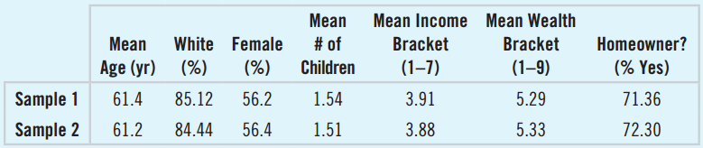

## Sampling: The Big Ideas

There are three main ideas in sampling:

1. Only examine a smart part of the group we wish to study
2. Randomization
3. Sample Size

We'll go through them one-by-one

## Examining Part of the Group
What's the goal of statistics?

- To learn about an entire population of individuals (not necessarily humans, it could be cars, trees, cancer, whatever)

So what's the problem?

- Examining entire populations is usually impossible

What can we do?

- Collect data from a small group, called a **sample**, of the population

## Samples

Samples of people often include:

- Telephone surveys
- Exit polls from elections
- Data from customers
- Student Surveys
- Medical studies

Other types of samples are used in scientific experiments

- Biological Research
- Crash Tests

## Bias
Sampling properly can be tricky

- We need a sample that is **representative** of our population
- We need to avoid **bias**, or over-emphasizing some characteristics of the population
- Samples that have bias can be misleading or completely useless

So how do we avoid bias?

## Randomization
We need to represent characteristics of our population without bias, like:

- Race
- Age
- Income
- Work type
- Family size

We use randomization to make sure these are represented accurately

- Randomizing protects studies from unfairly including some groups over others
- On average (in the long term), randomized samples look like the population

## Are random samples representative?

Samples 1 and 2 are random samples with 8000 customers of a particular company.  How'd we do?

- All of the statistics are similar for each sample
- It's likely that they're both fairly representative of the larger population of customers

## The Sample Size
How effective our sampling methods are depends largely on one thing:

- The **sample size**
- The sample size is the number of individuals or cases included in the study
- In statistics, we always use the variable $n$ for sample size

## Sample Size
For example, say we wanted to study whether or not being a member of a social fraternity or sorority affects academic performance, as measured by GPA, for WVU students.  We want to be able to detect a half-point difference.  There are approx. 23,000 undergraduates at WVU.

- Using statistical theory, we calculate that we need a sample size of $n = 100$ from each group

What if we wanted to be able to detect the same difference in all 31 million American undergraduates?

- Everything else being equal (i.e., means and standard deviations), we still only need $n=100$
- The sample size is important, not the percentage of the population.

## How big of a sample do we need?

The sample size we need depends on what we're doing

- For proportions or percentages, we usually need several hundred individuals
- For averages, we can often get away with smaller samples
- In general, the more precise the study needs to be, the larger the sample size needs to be

Major Factors

- The size of the difference we want to detect (e.g., the difference between 3.0 and 3.1 vs. 3.0 and 3.5)
- The variability of the population

## Sample Size
Generally speaking,

- The larger the sample size, the more reliable the results will be
- To represent a diverse population (with many sub-groups, like race or work industry), we'll need a pretty big sample

Getting a large sample can be hard

- For experiments like medical studies, it can be very expensive
- In telephone polls, only 38% of people usually answer, so they need to sample 2632 people to get 1000 responses

## A Census
Why not try to get everyone in the sample?

- Including the entire population is called a **census**
- It's expensive and takes a long time
- There will always be people unwilling to respond
- There will always people we can't reach
- Populations are constantly changing (births and deaths)

## More Issues
If we go ahead and take a census anyway, what can go wrong?

Double counting:

- College students commonly get counted at home and at school

Under-counting:

- The poor, homeless, or people who travel constantly can get missed

So why don't we sample instead?

- Politicians don't like it (the Constitution says we need to **count** everyone, not estimate the count)
- Statisticians think we should because we'll always miss people, and therefore have biased results
- Random sampling would be more reliable

## Populations and Parameters
We've mentioned how we study populations, but what about them do we study?

Say a recent study concluded that 27% of all US teens don't wear seatbelt.  How do they really know that?

- They used a **sample proportion** and made an **inference** about the **population proportion** (more on that in later chapters)
- A **parameter** is a number that is used to model a **population**
- a **statistic** is a number calculated from the **sample** (usually to estimate the parameter)
- Note that we *usually* use Roman letters $(\bar{x}, s)$ for statistics and Greek letters $(\mu, \sigma)$

## Examples of Parameters and Statistics

Value | Statistic | Parameter
------|-----------|-----------
Mean  | $\bar{x}$ | $\mu$ (mu, pronounced "mew")
Standard Deviation | $s$ | $\sigma$ (sigma")
Correlation | $r$ | $\rho$ (rho, pronounced "row")
Regression Coefficients | $b_0, b_1$ | $\beta_0, \beta_1$ (pronounced beta-naught, beta-one)
Proportion | $\hat{p}$ | $p$ (not a Greek letter)

## Representative Samples
We usually want to estimate parameters with statistics

- The sample sample statistics need to be representative or unbiased estimates of the parameters
- In order to do this, we need a **representative sample**
- If our sample is biased, our statistics will be biased
- Biased statistics may be mush higher or much lower than the true value of the parameter

## Simple Random Samples

The most common type of representative sample is the **simple random sample** (SRS).

- Most statistical tests are based on the idea of an SRS
- In an SRS, each individual in the population is equally likely to be chosen
- Any group of a certain size is just as likely as any other group of a certain size

Say we have 40 students, 20 are male and 20 are female.  We want an SRS of 20 students.

- Number each student 1 through 40
- Use software to randomly choose 20 numbers from 1 to 40
- Choose the students whose label matches the software output

## Simple Random Samples
How not to take an SRS of our 40 students:

- Flip a coin
- If it's heads, pick all males
- If it's tails, pick all women
- It is random
- Every student is equally likely to be chosen

Why doesn't it work?

- There's no way to select a sample containing both men and women

## The Sampling Frame
The **sampling frame** is the group of all individuals from which we draw our sample, but it's not as straightforward as you might think.

If we're studying college students, 

- Do we include part-time students?
- Online Students?

If we're studying Americans,

- Do we only include citizens? 
- What about permanent residents?

## Sampling Variability
Statistics will vary from sample to sample:

- In one sample, we might find the average IQ to be $\overline{IQ} = 102$
- In a second sample, we might find an average IQ of $\overline{IQ} = 98$
- By definition, the average IQ in the population is $\mu = 100$

Variability from sample to sample is called **sampling variability** or **sampling error**.

- Sampling variability is a natural part of statistics, not a problem
- All statistical tests are designed to account for this variability
- In fact, if there were no variability there would be no point in statistics

## Other Sampling Designs
The SRS is the ideal sampling method, but it doesn't always work

- If there's are distinct groups in the data, we need a large sample to make sure it's representative
- If the population is very spread out geographically it can be very expensive

There are three alternative sampling methods we'll mention:

- Stratified Sampling
- Cluster Sampling
- Systematic Sampling

## Stratified Sampling
In **stratified sampling**:

- We divide our sampling frame into homogenous groups called **strata**.  
- We then select samples from within the strata, proportional to the size of the strata

Example:

- We want to sample 100 college students to ask them about their positions on football funding
- The college is 60% women and 40% men
- We would randomly sample 60 female students and 40 male students

## Benefits of Stratifying

Reducing Bias:

- We make sure we don't over- or under-represent a particular group

Common strata:

- Gender
- Race
- Industry of Employment

Stratifying is mostly used when there are large differences between groups in our population

## Cluster Sampling
In **cluster sampling**:

- We divide the population into representative groups or clusters
- Then, only a few of these clusters are selected

Example:

- We want to sample 2000 trees in a national forest
- Conducting an SRS would be impractical
- Instead, we divide the forest into grids of 100 trees and select 20 grids

Cluster sampling is ideal when the data is in distinct groups, or very spread out

## Clusters vs. Strata
Cluster sampling and stratified sampling are similar, but not identical.  What's the difference?

Imagine our population as a pepperoni pizza:

- Cluster sampling is taking an entire slice
- Stratified sampling grabs a sample of each ingredient, proportional to the portions in the recipe

## Multistage Sampling
We can also combine sampling strategies in a single study.  For example, say we want to know the average length of the sentences in our textbook.

1. Stratify the book into its six parts
2. Take an SRS of three pages within each part
3. Cluster by paragraph, then randomly select two paragraphs
4. Count the words in these clusters

## Systematic Samples
If any of the sampling methods are too expensive, an alternative is **systematic sampling**, where we simply choose every $k^{th}$ individual in our sampling frame.

For example:

- Survey every 10th student walking into a building
- Test the engine of every 50th car on an assembly line
- Count the words on every 80th line of a book

Why don't we always do this?

- It's not a truly **random sample**
- For large sample sizes, it can be close enough

## Name the Sampling Strategy
We want to survey 30 passengers on a flight of 300 people from Tokyo to San Francisco.  Name whether each method is a simple random sample, systematic sample, cluster sample, or stratified sample:

- Picking every 10th passenger alphabetically
- Randomly pick 5 first class, 10 business class, and 15 coach passengers
- Randomly generate 30 seat numbers and survey those people
- Randomly select a seat position (window, aisle, center) and survey those people

## Valid Surveys

Surveys are a particularly troublesome type of study, because they can be very subject.  Any time you read about or take a survey, you should be careful about how it was designed.

Was their sample representative?

- Sampling customers about their preferences missed those who prefer a competitor
- Asking students in 8am classes "are math classes best taken in the morning?"

Did they only ask what they needed?

- Long surveys can make respondents tired and careless

## Valid Surveys
Did they ask specific questions?

- Worse:  "Do you read never, a little, or a lot?"
- Better: "How many books did you read last year?"

Did they ask questions that people can answer?

- Asking "How many servings of vegetable do you eat?" without defining a serving size
- Asking Americans "Is the ambassador to Uraguay doing a good job?"

## Valid Surveys
Did they ask questions people are likely to lie about?

- "Do you have an STD?"
- "Are you a criminal?"

Did they put words in the question that can lead the respondent or bias the answer?

- "Should the state of WV improve education by raising revenue?"
- "Should the state of WV burden residents with more taxes just to waste them in a failing education system?"

## Pilot Surveys
If a group putting out a survey want to check how well their survey works, they often put out a **pilot survey** by sending a draft to a small group and changing their questions if:

- The respondents were confused
- The responses aren't helpful
- There are issues with calculating statistics or graphing data

## Bad Sampling Designs
There are several bad, but common, sampling problems which don't give representative results.

1. Voluntary Response Samples
2. Convenience Samples
3. Bad Sampling Frame
4. Undercoverage

##Voluntary Reponse Samples
**Voluntary Reponse Samples** are surveys that are open to many, but only few respond

- Internet polls
- Talk radio
- Letters to congress

Why are they bad?

- The sampling frame doesn't correspond to the population
- Only the most opinionated respond, so we often see bias

## Convenience Samples

When we take **Convenience Samples,** we only get samples that are convenient to us

- Asking Facebook friends
- A mall surveying its customers about why they like malls
- Asking restaurant customers about how much they spend on food

Why are they bad?

- You usually only get people similar to you
- Asking restaurant customers ignores people who never eat out, etc.

## Bad Sampling Frames
We can get a **bad sampling frame** if our sampling method miss large groups in our population.  Common groups that are missed are:

- Prisoners
- The Homeless
- Students
- Long-term Travelers
- People with strong privacy settings (on phones, email, etc.)

## Undercoverage
**Undercoverage** is similar to having a bad sampling frame, but instead of not trying to reach certain groups, we try to reach them but they still end up being missed or under-represented.  This is often something out of the researchers' control.

- Evening phone surveys miss night-shift workers
- Door-to-Door surveys miss people who are often on-the-go
- Surveys in English may miss speakers of other languages

## Survey Bias
All of these problems lead to biased results.  There are two major types of bias that result,

- **Nonresponse Bias**
- **Response Bias**

## Nonresponse Bias
**Nonresponse bias** results from undercoverage, where certain classes of people might not respond

- Usually, it's better to put a lot of effort into reaching a smaller sample than to put minimal effort (per person) into a large survey
- Researchers should carefully think about why people might not be responding and adjust for it
- It's often hard to measure our nonresponse bias, because we can't know what the people who didn't respond are thinking.

## Response Bias
**Response bias** is a bias that results from the design of the survey.

- Interviewees try to please or impress interviewers
- People don't want to embarass themselves or admit their flaws
- People hide or embellish facts about themselves like income or age
- The questions can be leading or steer respondents in certain directions ("Should be improve" vs. "Should cut funding", etc).

## Summary

- We try to describe or study large populations by using **samples**
- Numbers that describe samples are called **statistics**, while numbers that describe populations are called **parameters**
- Sampling methods need to be **representative** and **unbiased**
- There are several commonly used sampling methods: **simple random samples (SRS)**, **stratified samples**, **cluster samples**, and **systematic samples**
- Each method has advantages in certain situations
- Problems in our sampling method lead to **biased** results, which do not accurately represent the population

