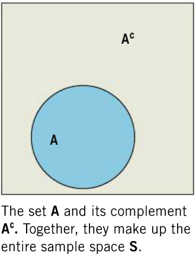
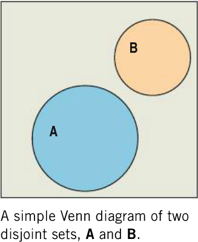

```{r global_options, include=FALSE}
knitr::opts_chunk$set(echo = FALSE, fig.width = 10, fig.height = 5, fig.align = "center", 
                      message = FALSE, warning=FALSE, cache = TRUE) 
library(dplyr, quietly = TRUE, warn.conflicts = FALSE)
library(tidyr, quietly = TRUE, warn.conflicts = FALSE)
library(ggplot2, quietly = TRUE, warn.conflicts = FALSE)
ps <- element_text(size = 12)
ps2 <- element_text(size = 15)
ps3 <- element_text(size = 20)
this.theme <- theme(axis.title.x = ps2, axis.title.y = ps2, axis.text.x = ps, axis.text.y = ps, 
                    title = ps3,
                    legend.text = ps)
```

## Review

Recall from Chapter 9:

- When a situation is random, we know what outcomes can **possibly** occur, but not which outcome will happen next
- Randomness is uncertain in the short term, but well-behaved in the long term

In this chapter, we will:

- Formalize the concepts of randomness
- Introduce the ideas of probability

## Random Phenomena
A **random phenomena** is a situation in which we know what outcomes can **possibly** occur, but not which one will occur next.

Examples:

- Approaching a stoplight
- Flipping a coin
- Rolling a die
- Seeing how long it will take for a bus to arrive

## Vocabulary
A trial:

- Each occasion where we observe the outcome of a random phenomena

Outcome:

- The value that we observe for a trial

Event:

- Any combinations of possible outcomes (or a single outcome)

Sample Space:

- The list of all possible outcomes

## Example: Flipping Two Coins
The Trial:

- Every time we flip the two coins, it is one trial

The Outcomes:

- The result of flipping the coins, e.g. $HH$ or $HT$

Events:

- Any combination of results, e.g. getting *at least one heads* $\{HH, HT, TH\}$

The Sample Space:

- $S = \{HH, HT, TH, TT\}$

## Relative Frequencies and Probability
Early, we saw the the **relative frequency** or **sample proportion** of a categorical variable was:

- $\hat{p} = \frac{\text{# of successes}}{\text{sample size}} = \frac{x}{n}$

The relative frequency is often used to estimate the probability of an event occuring.  If we flip a coin ten times and see 4 heads,

- $\hat{p} = \frac{x}{n} = \frac{4}{10} = 0.4 = 40\%$

When studying probability, the sample size $n$ is the **number of trials**

## The Long Term
We say that random events are well behaved in the long term.  What do we mean?

- If we flip a coin once, we get 100% or 0% heads.
- If we flip a coin 10 times, we would expect about 5 heads
- Getting 4 or 6 heads is less likely, but not uncommon
- 3 or 7 would be even less likely, but nothing to write home about
- 2 or 8; 1 or 9; and 0 or 10 are pretty rare, but might happen every once in a while
- As we flip the coin more, the proportion of heads should be close to $\frac{1}{2}$
- The more times we flip the coin, getting away from 50% gets harder

## The Law of Large Numbers (LLN)
We call the long term probability the **empirical probability** (but it is still an observed probability, $\hat{p}$)

The **Law of Large Numbers** says

- As we increase the number of trials, the relative frequency settles towards the empirical probability

## LLN Requirements
Identical Probabilities:

- The probability of successes does not change from trial to trial
- The probability of getting heads when flipping a coin is always $\frac{1}{2}$

Independence

- The outcome of one trial does not effect the outcome of any others
- Phenomena that meet this requirement are sometimes called **memoryless**
- A coin doesn't remember what came up last time

## LLN Example: Flipping Coins, $n = 100$
```{r}
n <- 100
x <- rbinom(n, 1, .5)
p.hat <- sapply(1:n, function(i) sum(x[1:i])/i, USE.NAMES = FALSE)
dat1 <- data.frame(n = 1:n, x = x, p.hat = p.hat)
ggplot(dat1, aes(x = n, y = p.hat)) + geom_point(size = 2) + geom_line(size = 1) + 
  geom_hline(yintercept = .5, color = "red", size = 1) + this.theme
```

## LLN Example: Flipping Coins, $n = 1000$
```{r}
n <- 1000
x <- rbinom(n, 1, .5)
p.hat <- sapply(1:n, function(i) sum(x[1:i])/i, USE.NAMES = FALSE)
dat2 <- data.frame(n = 1:n, x = x, p.hat = p.hat)
ggplot(dat2, aes(x = n, y = p.hat)) + geom_line(size = 1) + 
  geom_hline(yintercept = .5, color = "red", size = 1) + this.theme
```

## LLN Example: Flipping Coins, $n = 10000$
```{r}
n <- 10000
x <- rbinom(n, 1, .5)
p.hat <- sapply(1:n, function(i) sum(x[1:i])/i, USE.NAMES = FALSE)
dat3 <- data.frame(n = 1:n, x = x, p.hat = p.hat)
ggplot(dat3, aes(x = n, y = p.hat)) + geom_line(size = 1) + 
  geom_hline(yintercept = .5, color = "red", size = 1) + this.theme
```

## LLN Example: Rolling 10000 Dice
```{r}
n <- 10000
x <- rbinom(n, 1, 1/6)
p.hat <- sapply(1:n, function(i) sum(x[1:i])/i, USE.NAMES = FALSE)
dat4 <- data.frame(n = 1:n, x = x, p.hat = p.hat)
ggplot(dat4, aes(x = n, y = p.hat)) + geom_line(size = 1) + 
  geom_hline(yintercept = 1/6, color = "red", size = 1) + this.theme
```

## The Law of Averages
If I flip a coin 5 times and get heads each time, am I *due* for a tails?

- **NO**. If the trials are independent, you are never due for a particular outcome
- The "law of averages" doesn't exist-- in the short term we can never know what will happen next

If you lose twenty poker hands in a row, are you due for some good luck?

- Absolutely not.
- The "law of averages" is also called the *gambler's fallacy*

If San Francisco averages a major earthquake every 100 years, and they haven't had one since 1906, are they due for another this year?

- Again, no.  The average is only in the **long term**, it says nothing about this year.

## Modeling Probability
So far, we've discussed the probabilities of event's we've already observed.  Now we'll shift to **theoretical probabilities**.

Notation

- We call the probability of event $A$ occuring $P(A)$

If all outcomes are equally likely, the probability of event $A$ can be calculated as:

- $P(A) = \frac{\text{# of ways A can occur}}{\text{Total # of outcomes}}$

Describing Probability

- Probabilities are generally written as proportions/decimals
- They can also be written as percent chances

## Examples
Consider flipping a coin twice.  What's the sample space?

- $S = {HH, HT, TH, HH}$

Let $A$ be getting one heads.  What is $P(A)$?

- $A$ can occur 2 ways: $HT, TH$
- $P(A) = \frac{2}{4} = \frac{1}{2}$

Let $B$ be getting at least one heads.  What is $P(B)$?

- $B$ can occur 3 ways: $HH, HT, TH$
- $P(B) = \frac{3}{4}$

## Equally Likely
Say we pick two people randomly.  What's the probability we select two left-handed people?

- $S = {LL, LR, RL, RR}$

Using our formula from before,

- $P(LL) = \frac{1}{4}$

Does this hold up?

- There are way more right handed people than left-handed, so $P(LL) \ne \frac{1}{4}$
- For more complicated probability models, we need better methods
- We will discuss these in detail in Chapter 14
- For now, I'll give you probabilities of events

## Formal Probability
Now we can start using probability to solve more interesting problem.  For now, we'll focus on simple cases:

**Disjoint events**

- Events $A$ and $B$ have no outcomes in common.
- They cannot occur in the same trial.
- E.g., heads and tails on a coin flip

**Independent events**

- Events $A$ and $B$ are independent if knowing that $B$ happened, it doesn't tell us about $A$
- If traffic is the same every day of the week, knowing what day it is doesn't tell me if I'll make it to work on time

## Rules 1 and 2
Rule 1: $0 \le P(A) \le 1$

- Probabilities cannot be less than 0 or above 1
- You can't have a 125% chance of winning a game $(P(A) = 1.25)$
- A percent chance of -45% is just as non-sensical $(P(A) = -0.45)$

Rule 2: $P(S) = 1$

- $S$ is the sample space, and describes **all** possible outcomes
- One of these outcomes needs to have happened
- There must be a 100% chance of one of the outcomes happening

## Rule 3: The Complement Rule
The **complement** of an event is its opposite. 

- We write the complement of $A$ as $A^C$
- If $P(A)$ is the probability of $A$, $P(A^C)$ is the probability of $A$ **not** occuring
- $A$ will either occur or not occur, so $P(A) + P(A^C) = 1$
- The **complement rule**: $P(A^C) = 1 - P(A)$

If we roll a six-sided die, the probability of getting a 1 is $\frac{1}{6}$.  What is the probability of not rolling a 1?

- $P(A) = \frac{1}{6}$
- $P(A^C) = 1 - \frac{1}{6} = \frac{6}{6} - \frac{1}{6} = \frac{6 - 1}{6} = \frac{5}{6}$

## Visualizing the Complement Rule


## Complement Rule Example
Say that the probability of getting a greenlight at a particular intersection is 0.35.  What is the probability of not getting a green light?

- $$\begin{align}
    P(\text{not green}) &= P(\text{green}^C)\\
      &= 1 - P(\text{green})\\
      &= 1 - 0.35\\
      &= 0.65\\
  \end{align}$$
- There is a 65% chance of getting a yellow or red light at the intersection.

## Rule 4: The Addition Rule

If two events are **disjoint**, the probability of $A$ or $B$ is given as:

- $P(A\; \text{or}\; B) = P(A) + P(B)$
- We will discuss handing events that are not disjoint in the next chapter


## Addition Rule Example
Say the there is a 35% chance of a particular stoplight being green, and a 4% chance of it being yellow.  What is the probability we get through the light?

- We make it through if the light is green *or* yellow
- $P(G) = 0.35$
- $P(Y) = 0.04$
- $P(Y\; \text{or}\; G) = 0.35 + 0.04$
- $P(Y\; \text{or}\; G) = 0.39$
- There is a 39% chance of making it through the light

## Addition Rule -- Not Disjoint
Say there is a 65% chance of a person owning a smartphone and a 40% chance that they own a laptop.  What's the chance that they own a smartphone or a laptop?

Using the rules we know:

- $P(\text{smartphone}) = 0.65$
- $P(\text{laptop}) = 0.40$
- $P(\text{smartphone or laptop}) = 0.65 + 0.40 = 1.05$
- This means that there is a 105% chance they own on or the other
- **This violates rule 1**
- We run into problems because people can own **both**, so they're not disjoint events
- We'll learn how to handle this situation in Chapter 13

## Combining Rules
Using our intersection from before, where $P(G) = 0.35$ and $P(Y) = 0.04$, what is the probability that we don't make it through the intersection?  We need to find the probability of seeing a redlight, which we'll call $P(R)$

- $$\begin{align}
    P(R) &= 1 - P(R^C)\\
      &= 1 - P(G\; \text{or}\; Y)\\
      &= 1 - \left[P(G) + P(Y)\right]\\
      &= 1 - \left[0.35 + 0.04\right]\\
      &= 1 - 0.39\\
      &= 0.61\\
  \end{align}$$
- There is a 61% chance of missing the light

## Rule 5: The Multiplication Rule

If two events are **independent**, knowing that one event occured does not influence the probability of the other event.  In this case,

- $P(A\; \text{and}\; B) = P(A) \times P(B)$
- This extends to more than two **independent** events
- $$\begin{align} P(A\;\text{and}&\; B\; \text{AND}\; C)\\ &= P(A)\times P(B) \times P(C)\end{align}$$
- We will see how to deal with **dependent** events in the next chapter.

## Multiplication Rule Example
Say our stoplight behaves the same way every day of the week.  This means that day of the week is independent of the color of the light when we approach the intersection.  What is the probability of getting a greenlight on Monday, a yellow light on Tuesday, and a redlight on Wednesday?


- Because day and light are independent, $P(\text{color})$ given day = $P(\text{color})$
- $$\begin{align}
    P(\text{G Mon. AND Y Tues. AND R Weds.}) &= P(G) \times P(Y) \times P(R)\\
      &= 0.35 \times 0.04 \times 0.61\\
      &= `r round(0.35*0.04*0.61, 3)`\\
  \end{align}$$
- There is a 0.9% chance of getting this sequence of lights on consecutive days.
- Note that, because this is multiplication, the order of the lights doesn't matter.

## Combining Rules
What is the probability that, in a given week, we get at least one redlight?

- $$\begin{align}
    P(\text{at least 1 red}) &= 1 - P(\text{at least 1 red}^C)\\
      &= 1 - P(\text{no reds})\\
      &= 1 - P(\text{not red})^7\\
      &= 1 - (R^C)^7\quad \text{(we found}\; P(R^C)\; \text{earlier)}\\
      &= 1 - 0.39^7\\
      &= 1 - `r round(0.39^7, 4)`\\
      &\approx `r 1 - round(0.39^7, 4)`
  \end{align}$$
- There is about a 99.86% chance of hitting a redlight at least once in a week.

## What can go wrong?
Check that probabilities that don't add up to exactly one

- If they add up to less than one, you're missing an outcome
- If they add up to over one, you don't have disjoint events

Don't just add probabilities of events if they're not disjoint

- We have a better rule for this situation 

## What can go wrong?
Don't just multiply events that aren't independent:

- $$\begin{align}P(\text{Over}&\text{ 6' and on basketball team})\\ 
    &\ne P(\text{over 6'})\times P(\text{on basketball team})\end{align}$$
- We have a better rule for this

Don't confuse disjoint and independent

- Getting heads and tails are disjoint
- If its heads, it cannot be tails
- heads and tails cannot be independent because knowing that a coin flip ended in tails means the probability of it being heads is zero


