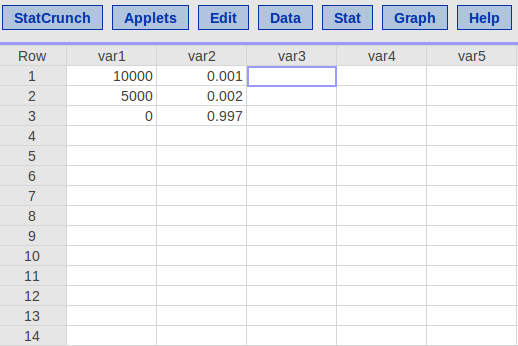
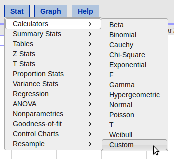
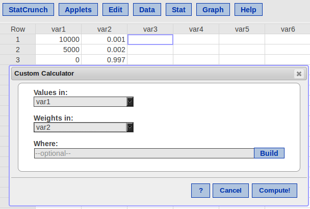
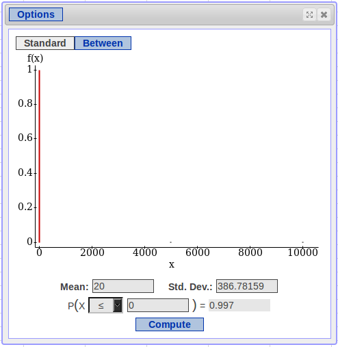
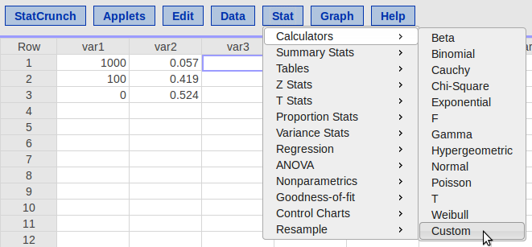
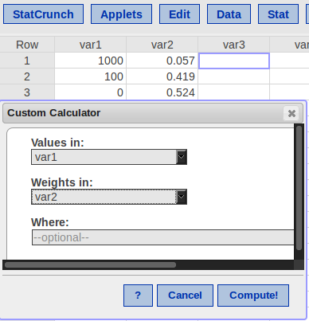
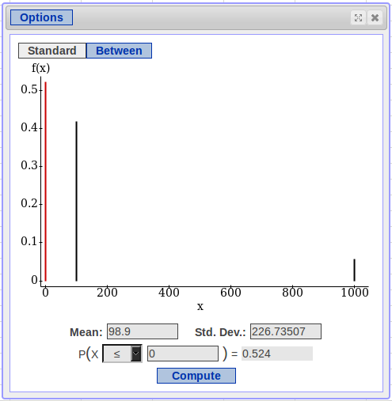
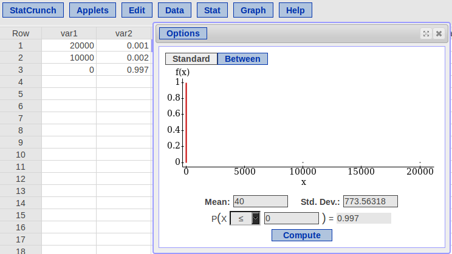

```{r global_options, include=FALSE}
knitr::opts_chunk$set(echo = FALSE, fig.width = 10, fig.height = 5, fig.align = "center", 
                      message = FALSE, warning=FALSE, cache = TRUE) 
library(dplyr, quietly = TRUE, warn.conflicts = FALSE)
library(tidyr, quietly = TRUE, warn.conflicts = FALSE)
library(ggplot2, quietly = TRUE, warn.conflicts = FALSE)
ps <- element_text(size = 12)
ps2 <- element_text(size = 15)
ps3 <- element_text(size = 20)
this.theme <- theme(axis.title.x = ps2, axis.title.y = ps2, axis.text.x = ps, axis.text.y = ps, 
                    title = ps3,
                    legend.text = ps)
```

## Overview
In Chapters 12--13, we saw:

- How to decribe random phenomena as trials
- How to use probability rules to describe the outcomes of these trials

In this chapter, we will:

- Describe the long-term behavior of random phenomena using **probability distributions**
- See how many phenomena can be modeled using several common named distributions

## Background: Insurance
Say a particular insurance company offers a "death and disability" policy with the following payouts:

- $10,000 for death
- $5,000 for disability

They charge a $50 premium per year.  How profitable do they think they'll be?

- We need to know the probability that a given client will be killed or disabled
- With this information, we can find the **expected value** of their product
- We can also find the **standard deviation**, which can tell us about the uncertainty they'll face

## Probability Models
Recall that a mathematical model is just a formula that is used to represent the real world

- $Area = Base \times Height$
- $Speed = \frac{distance}{time}$

A statistical model is a mathematical model which accounts for the uncertainty of random events.

- $\hat{y} = b_0 + b_1x$

A **probability distribution** is a specific type of statistical model which describes the probability of certain events happening.

- $X \sim N(\mu,\; \sigma)$

## Definitions
A **Random Variable**:

- A variable whose value is random.  
- Each time we observe the variable, it is a random trial.
- A particular coin flip is a random trial, but flipping a coin is a random variable
- We typically denote random variables with capital letters, like $X$ and its value using lower-case letters
- "$X=x$" means "the variable $X$ taking the value $x$"
- $P(X = x)$ is the probability that $X$ takes the value $x$
- We usually use the shorthand $P(x)$

## Insurance: The Variable
For our insurance example, we'll denote the amount paid out $X$.  Suppose that the following is true:

- One in one thousand people will be killed in a given year, on average.
- Two in one thousand people will be disabled, on average.

How do we represent this?  Usually with a table

- Outcome | Payout $(x)$ | Probability $P(x)$ 
----------|------------------|---------------------------
Death     | $10,000 | $\frac{1}{1000}$
Disability | $5,000 | $\frac{2}{1000}$
Neither | $0 | $\frac{997}{1000}$

## Discrete vs. Continuous
A **discrete** random variable:

- A variable whose outcomes we can list
- The payout is discrete, because we can list all three outcomes

A **continuous** random variable:

- There are too many possibilities to list
- We usually deal with ranges
- Usually measurements are continuous
- Something can weigh 1 kg, 1.1 kg, 1.11 kg, 1.111 kg, etc.
- Technically, there are an **infinite** number of possible outcomes

## Valid Distributions
The outcomes in a probability distribution make up the **sample space**, so we need to follow the same rules as in Chapter 12

In the discrete case:

- All of the probabilities need to add up to exactly 1
- Outcomes cannot overlap
- Every probability needs to $\ge 0$

In the continuous case:

- The same basic rules apply, but we need calculus to verify them
- For this class, just trust that they're valid

## 14.1 The Expected Value
The **expected value** is the **long-term average outcome** or **population mean** of a random variable.  

- If we repeatedly observe it, what's the average?
- If we haven't observed a particular trial yet, what do we expect to happen?

Notation

- $E(X)$ or $\mu$
- We use $E(X)$ if we're just describing the variable
- We use $\mu$ if it's the parameter of a model, e.g. in the Normal Distribution

Calculation

- $E(X) = \sum xP(x)$

## Insurance: The Expected Value

Outcome | Payout $(x)$ | Probability $P(x)$ 
----------|------------------|---------------------------
Death     | $10,000 | $\frac{1}{1000}$
Disability | $5,000 | $\frac{2}{1000}$
Neither | $0 | $\frac{997}{1000}$

Finding $E(X)$

- $E(X) = \sum xP(x)$
- $E(X) = \$10000\left(\frac{1}{1000}\right) + 
  \$5000\left(\frac{2}{1000}\right) + \$0\left(\frac{997}{1000}\right)$
- $E(X) = \frac{\$10000}{1000} + \frac{\$10000}{1000}  = \$10 + \$10 = \$20$

## Insurace: Interpreting $E(X)$
We found $E(X) = \$20$.  What does this tell us?

- For a given customer, the company expects to spend $20
- Remember that they charge $50 for the policy
- For each customer, we have an expected profit of $30

Note

- They only ever pay out $10,000, $5,000 or $0
- They'll either lose $9,950 or $4950, or they can keep all $50
- Since most people will not get injured or killed, the larger number of customers who give them pure profit balance out those who cost them thousands
- This is the basis for all insurance/warranty plans

## 14.2 The Standard Deviation
For the insurance example, we had a wide range of outcomes.  This means that there's a large amount of **uncertainty** or **variability** from customer to customer.  

- Just like with the spread of samples, we describe the spread of probability distributions with the **standard deviation**.
- In samples, we found the variance as the *average squared distance* from observations to the mean
- The standard deviation was the square root of the variance
- For distributions, we use the *expected squared distance* from each outcome to the *expected value*


## The Standard Deviation
Notation:

- We use $VAR(X)$ or $\sigma^2$ to denote the distribution's variance
- We use $SD(X)$ or $\sigma$ to denote the distribution's standard devation

Calculation:

- $VAR(X) = \sigma^2 = \sum (x - \mu)^2P(x) = \sum x^2P(x) - \mu^2$
- $SD(X) = \sqrt{VAR(X)}$ or $\sigma = \sqrt{\sigma^2}$

## Insurance: The Standard Deviation
For our insurance company, $X = \{\$10000,\; \$5000,\; \$0\}$ and $E(X) = \$20$.  Finding the standard deviation:

- $\sigma^2 = \sum (x - \mu)^2P(X)$
- $\sigma^2 = (10000 - 20)^2\left(\frac{1}{1000}\right) + (5000 - 20)^2\left(\frac{2}{1000}\right) +
  (0 - 20)^2\left(\frac{997}{1000}\right)$
- $\sigma^2 = (9980)^2\left(\frac{1}{1000}\right) + (4980)^2\left(\frac{2}{1000}\right) +
  (-20)^2\left(\frac{997}{1000}\right)$
- $\sigma^2 = (9960040)\left(\frac{1}{1000}\right) + (24800400)\left(\frac{2}{1000}\right) +
  (400)\left(\frac{997}{1000}\right)$
- $\sigma^2 = 99600.4  + 49600.8 + 398.8$
- $\sigma^2 = 149600$
- $\sigma = \sqrt{149600} = 386.7816$

## Insurance: The Standard Deviation
What does it tell us that $\sigma = \$386.78$?

- There's a big difference between paying out thousands or pocketing $50
- While we expect to make $30 per person in the long term, there is a lot of uncertainty about individual customers
- They'll probably make a lot of profit if they insure thousands, but insuring a small number of people is a lot of risk

## In StatCrunch
This isn't an algebra class, so we can use StatCrunch to do the heavy lifting.

- Open a blank data set
- Enter the values of $X$ as on column
- Enter the probabilities as another column
- `Stat` $\to$ `Calculators` $\to$ `Custom`
- Select the columns
- Hit `Compute`

## In StatCrunch



## In StatCrunch



## Example: Refurbished Computers
Say a company sells custom computers to businesses.  A particular client orders two new computers, but they refuse to take refurbished (repaired) computers.

- Someone made an error in stocking, and of the 15 computers in the stock room 4 were refurbished
- Since the company filled the order by randomly picking up computers from the stock room, there was a chance they shipped 0, 1, or 2 refurbished computers
- If the client just gets one refurbished computer, they'll ship it back at the computer company's expense, costing them $100
- If they get two refurbished machines, they'll cancel the entire order, and the computer comany will lose $1000.

## Refurbished Computers: Probabilities
Getting Two New Computers

- There are 11 new machines out of 15
- $P(\text{first new}) = \frac{11}{15}$
- $P(\text{second new } | \text{ first new}) = \frac{10}{14}$ 
- $P(\text{both new}) = P(\text{first new} \text{ AND } \text{second new } | \text{ first new})$
- $P(\text{both new}) = P(\text{first new}) \times P(\text{second new } | \text{ first new})$
- $P(\text{both new}) = \frac{11}{15} \times \frac{10}{14} = \frac{110}{210} \approx 0.524$
- There's a 52.4% chance the computer company doesn't lose money

## Refurbished Computers: Probabilities
Getting Two Refurbished Computers

- There are 4 refurbished machines out of 15
- $P(\text{first refurb.}) = \frac{4}{15}$
- $P(\text{second refurb. } | \text{ first refurb.}) = \frac{3}{14}$
- $P(\text{both refurb.}) = P(\text{first refurb.} \text{ AND } \text{second refurb. } | \text{ first refurb.})$
- $P(\text{both refurb.}) = P(\text{first refub.}) \times P(\text{second refub. } | \text{ first refurb.})$
- $P(\text{both refurb.}) = \frac{4}{15}\times\frac{3}{14} = \frac{12}{210} \approx 0.057$
- There's a 5.7% chance the computer company loses $1000

## Refurbished Computers: Probabilities
Getting One Refurbished Computer

- Note that the sample space only includes getting two new computers, getting two refurbished computers, or one of each
- $P(\text{both new}) + P(\text{both refurb}) + P(\text{one new}) = 1$
- $P(\text{one new}) = 1 - (P(\text{both new}) + P(\text{both refurb}))$
- $P(\text{one new}) = 1 - (0.524 + 0.057)$
- $P(\text{one new}) = 1 - 0.581$
- $P(\text{one new}) = 0.419$
- There's a 41.9% chance the computer company loses $100

## Refurbished Computers: The Probability Distribution

Outcome | Money Lost $(X)$ | Probability $P(x)$
--------|------------------|--------------------
Both Refurbished | $1000 | 0.057
One New | $100 | 0.419
Both New | $0 | 0.524 

Now we can use StatCrunch to find $E(X)$ and $SD(X)$

## In StatCrunch


## In StatCrunch



## Refurbrished Computers: Interpretation
$E(X) = \$98.9$

- The company should expect to lose $98.90 for this mistake
- While the most likely outcome is the company not losing money, the rare event of them losing $1000 carries a lot of weight

$SD(X) = \$226.74$

- There's a lot of uncertainty in this scenario
- They could lose 0, $100, or $1000.  Since there's only two computers, it's hard to predict exactly what will happen this one time.
- If this mistake were to be repeated, the outcome might be completely different

## 14.3 Combining Random Variables
Let's head back to the insurance example.

- We looked at the company's expected payout for a single person
- What if the company lowered the price of the premium from $50 to $45?
- What if we doubled the payouts?
- What would the expected payout be for two people?  The standard deviation?

It turns out we have simple rules for these problems.

## Adding a Constant
We saw in earlier chapters that adding or sutracting a constant from each value in a sample shifts the mean, but leaves the measures of spread alone.  The same is true for random variables.

- $E(X \pm c) = E(X) \pm c$
- $VAR(X \pm c) = VAR(X)$
- $SD(X \pm c) = SD(X)$

What if our insurance company lowered the premium by $5?

- $E(X) = \$20$, so the expected profit was $50 - $20 = $30
- If we lose an additional $5 from each customer, the expected profit is $45 - $20 = $25
- The standard deviation will stay the same

## Multiplying by a Constant
In earlier chapters, we saw that the mean and standard deviation were both scaled when multiplying by a constant.  The same holds true for random variables.

- $E(aX) = aE(X)$
- $VAR(aX) = a^2VAR(X)$, because we **square** all the differences from the means
- $SD(aX) = |a|SD(X)$, again because we are **squaring** things then taking the square root

So what happens if we double all payouts for the insurance company?

## Doubling Payouts
Outcome | Payout $(x)$ | Probability $P(x)$ 
----------|------------------|---------------------------
Death     | $20,000 | $\frac{1}{1000}$
Disability | $10,000 | $\frac{2}{1000}$
Neither | $0 | $\frac{997}{1000}$

Using StatCrunch,

- $E(X) = \$40$
- $SD(X) = \$773.56$

## Doubling Payments


## What Happened?

$E(X) = \$40$

- Because we doubled all payouts, the expected payout has doubled

$SD(X) = \$773.56 = 2\times \$386.78$

- By doubling all payouts, we doubled the differences between the outcomes
- Since the outcomes are further apart, we doubled the range of outcomes
- For any one customer, there is much more uncertainty in how much the company will lose

## Adding Variables
Instead of looking at a single customer, we'll look at two.  Call them Mr. $X$. and Mrs. $Y$.

Isn't looking at two customers the same as multiplying one customer's payouts by two?

- Not quite.  
- Mr. $X$ might die, but Mrs. $Y$ survives the year unharmed
- Mr. $X$ could stay safe, while Mrs. $Y$ gets maimed
- We have different rules for adding random variables

## Adding Variables
If $X$ and $Y$ are independent,

- $E(X + Y) = E(X) + E(Y)$
- $VAR(X + Y) = VAR(X) + VAR(Y)$
- $SD(X + Y) = \sqrt{VAR(X + Y)}$

## Insurance: Adding Variables
So what should the insurance company expect with Mr. $X$ and Mrs. $Y$?

$E(X + Y)$:

- $E(X + Y) = E(X) + E(Y) = 20 + 20 = 40$

$SD(X + Y)$

- $VAR(X + Y) = VAR(X) + VAR(Y)$
- $VAR(X + Y) = 149600 + 149600 = 299200$
- $SD(X + Y) = \sqrt{299200} = \$546.99$

## Insurance: Adding Variables
What happened?

- By doubling the number of policies, we've doubled the expected payout (but also the premiums we collect)
- Notice that $SD(X + Y) < SD(2X)$
- By insuring multiple people, we spread the risk around between the customers
- Even though the expected payout is the same as offering one policy with twice the coverage, we've reduced the uncertainty involved
- It's the same profit with less uncertainty

## Subtracting Variables
Instead of adding variables, we can also subtract them.  In general,

- $E(X \pm Y) = E(X) \pm E(Y)$
- $VAR(X \pm Y) = VAR(X) + VAR(Y)$
- $SD(X \pm Y) = \sqrt{VAR(X) + VAR(Y)}$

Note that, even when we subtract the variables, we **always** add the variances

## $X + X \ne 2X$
Like we saw with the insurance example, adding two random variables with the same distribution is not the same as multiplying one of them by two

- For the insurance, $2X = \{\$0, \$10000, \$20000\}$
- For both customers, the sample space includes all possible combinations of $X$ added together

We need to be careful with notation

- For a small number of variables, we might use $X$, $Y$, and $Z$
- For more variables, we often number them $X_1, X_2, \ldots, X_n$ where $n$ is our number of variables

## Multiple Observations
When we observe the same variable multiple times, like having two insurance customers, we can simplify things.  For each observation, the mean and variances are the same, so:

- $E(X_1 + X_2) = E(X_1) + E(X_2) = 2\times E(X)$
- $E(X_1 + X_2 + \ldots + X_n) = n \times E(X)$
- $VAR(X_1 + X_2) = VAR(X_1) + VAR(X_2) = 2\times VAR(X)$
- $VAR(X_1 + X_2 + \ldots + X_n) = n \times VAR(X)$
- $SD(X_1 + X_2 + \ldots + X_n) = \sqrt{VAR(X_1 + X_2 + \ldots + X_n)}$

## Example: Week and Weekend Shifts
Say you're a waiter at a restauarant and a large portion of your income is in tips.  During a typical 5-day work week, you make an average of $1200 with a standard deviation of $150.  On the weekends, you average $400 in tips with a standard deviation of $70.  Let $X$ represent the 5-day work week and $Y$ represent the weekend.

What do you expect to make for an entire 7-day week?

- $E(X + Y) = E(X) + E(Y) = \$1200 + \$400 = \$1600$

What is the standard deviation for the entire week?

- $VAR(X + Y) = VAR(X) + VAR(Y) = 150^2 + 70^2$
- $VAR(X + Y) = 22500 + 4900 = 27400$
- $SD(X + Y) = \sqrt{X + Y} = \sqrt{27400} \approx \$165.53$

## Example: Week and Weekend Shifts
Say that you typically make within one standard deviation of the mean.  What's a typical weekly salary for you?

- $E(X + Y) - SD(X + Y) = 1600 - 165.53 = \$1434.47$
- $E(X + Y) + SD(X + Y) = 1600 + 165.53 = \$1765.53$
- You typically make between $1434.47 and 1765.53

Only on really good weeks do you make more than two standard deviations above the mean. How much do you make in a really good week?

- $E(X + Y) + 2\times SD(X + Y) = 1600 + 2\times 165.53 = 1600 + 331.06$
- $E(X + Y) + 2\times SD(X + Y) = \$1931.06$
- Having a really good week means earning at least $1931.06

## Example: Monthly Income
Using the same information from before, let's call weekly income $W$.  $E(W) = \$1600$, $SD(W) = \$165.53$

How much would you expect to make in a month?

- $E(M) = E(W_1 + W_2 + W_3 + W_4) = 4 \times E(W)$
- $E(M) = 4 \times 1600 = \$6400$

What is the standard deviation for a month?

- $VAR(M) = VAR(W_1 + W_2 + W_3 + W_4) = 4\times VAR(W)$
- $VAR(M) = 4 \times 165.53^2 = 4 \times 27400.18 = 109600.7$
- $SD(M) = \sqrt{VAR(M)} = \sqrt{109600.7} = 331.06$

## Summary

- A **random variable** is a variable with a random outcome
- We describe the behavior of a random variable with a **probability distribution**
- The **expected value** or **mean** of a random variable describe the long-term average
- The **variance** and **standard deviation** describe the uncertainty or spread of a distribution
- When we add random variables, we can add the expected values and variances (but not the standard deviation)


