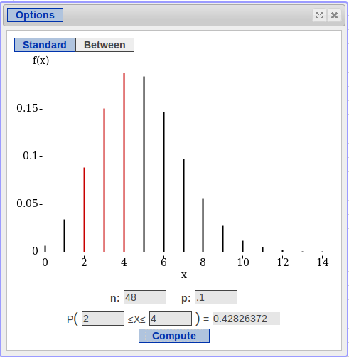

```{r global_options, include=FALSE}
knitr::opts_chunk$set(echo = FALSE, fig.width = 10, fig.height = 5, fig.align = "center", 
                      message = FALSE, warning=FALSE, cache = TRUE) 
library(dplyr, quietly = TRUE, warn.conflicts = FALSE)
library(tidyr, quietly = TRUE, warn.conflicts = FALSE)
library(ggplot2, quietly = TRUE, warn.conflicts = FALSE)
ps <- element_text(size = 12)
ps2 <- element_text(size = 15)
ps3 <- element_text(size = 20)
this.theme <- theme(axis.title.x = ps2, axis.title.y = ps2, axis.text.x = ps, axis.text.y = ps, 
                    title = ps3,
                    legend.text = ps)
```

## Overview
In Sections 14.1 - 14.3, we saw:

- How to describe random variables with their probability distributions
- How to combine random variables

In these sections, we will:

- Describe common situations with named distributions
- Discuss properties of these distributions
- Use named distributions to find probabilities

## Discrete Distributions
For now, we will focus on distributions that have discrete outcomes

- Discrete outcomes are outcomes that we can list
- In statistics, the most common of these are distributions which count occurances
- This is usually how we deal with categorical variables

We will see:

- The Bernoulli Distribution
- The Binomial Distribution
- The Poisson Distribution

## The Bernoulli Distribution
A **Bernoulli Trial** is a random trial where there are only two outcomes

- Yes or No
- Success or Failure

The **Bernoulli Distribution** describes the behavior of these trials.

- The only thing we need to describe a Bernoulli random variable (RV) is $p$, the probability of success

If a random variable follows the Bernoulli Distribution, we write:

- $X \sim B(p)$
- "X follows a Bernoulli Distribution with probability of success $p$"

## Describing Bernoulli Trials
In Bernoulli Trials, we denote the outcomes as:

- 0 for failure
- 1 for success

Since $p$ denotes the probability of success and there are only two outcomes:

- $P(1) = p$ is the probability of success
- $P(0) = 1 - p = q$ is the probability of failure

Note that "success" and "failure" are completely arbitrary.

## Bernoulli Example: Ebola
Say a doctor tells you that you have a particularly deadly strain of Ebola, which has an 80% mortality rate. Let $X$ denote your mortality and $p = .8$ be the probability you die.

What's the distribution look like?

- Outcome | $X = x$ | $P(X = x)$
----------|---------|-------------
Die   | 1       | $p = 0.8$
Survive | 0 | $q = 0.2$

## Bernoulli Expectations
What is the expected outcome of a Bernoulli Trial?

- $E(X) = \sum xP(x) = 1p + 0q = p$
- The expected value is the probability
- In the long term, this is the **proportion of successes**

For our Ebola example:

- $E(X) = p = 0.8$
- About 80% of people with the disease will die
- You are much more likely to die than survive

## Bernoulli Standard Deviations
What is the variance of a Bernoulli RV?

- $VAR(X) = \sum \left(x - E(X)\right)^2P(x)$
- $VAR(X) = pq$
- $SD(X) = \sqrt{pq}$

Notice that this will be largest when $p = .5$, reflecting the increased uncertainty that comes from both outcomes being equally likely.

For our Ebola case:

- $SD(X) = \sqrt{pq} = \sqrt{0.8\times 0.2} = \sqrt{0.16} = 0.4$


## The Binomial Distribution: Motivation
Say we want to flip two coins and count the number of heads:

- Outcome | $X = x$  | $P(X = x)$
----------|----------|------------
$HH$      | 2        | 0.25
$HT$      | 1        | 0.25
$TH$      | 1        | 0.25
$TT$      | 0        | 0.25

- $P(0) = 0.25 \quad P(1) = 0.5 \quad P(2) = 0.25$
- What if we flipped three coins?

--- 

Outcome | $X = x$ | $P(X = x)$
----------|---------|--------------
$HHH$     | 3       | $1/8$
$HHT$     | 2       | $1/8$
$HTH$     | 2       | $1/8$
$HTT$     | 1       | $1/8$
$THH$     | 2       | $1/8$
$THT$     | 1       | $1/8$
$TTH$     | 1       | $1/8$
$TTT$     | 0       | $1/8$

---

For the three coin flips,

- $$P(0) = 1/8 \quad P(1) = 3/8 \quad P(2) = 3/8 \quad P(3) = 1/8$$

The Problem

- For two trials, we had 4 rows.
- For 3 trials, we had 8.
- For 4 trials, we'd have 16.
- In general, for $n$ trials we have $2^n$ unique outcomes
- Tables like this quickly become unmanageable
- The Binomial Distribution is a convenient way to find these probabilities

## The Binomial Distribution
What is the binomial distribution?

- a **Binomial Experiment** is a series of $n$ bernoulli trials
- The **Binomial Distribution** describes the behavior of these trials

We only need two numbers to describe a binomial distribution:

- $n$, the number of trials
- $p$, the probability of success in each trial

If $X$ follows a binomial distribution:

- $X$ counts the number of success in the $n$ trials
- $X$ has to be a whole number from 0 to $n$

## Binomial Conditions
We can use a binomial distribution if:

- Each trial has only two outcomes (i.e., is a Bernoulli trial)
- Each trial is independent of the rest
- The probability of success, $p$, is constant for all trials

Notation:

- $X \sim Binomial(n, p)$
- $X$ follows a binomial distribution with $n$ trials and probability of success $p$

## Binomial Expectations
If $X \sim Binomial(n, p)$, the expected value and standard deviation have simple formulas.

Expectation:

- $E(X) = \mu = np$

Standard Deviation:

- $VAR(X)= \sigma^2 = np(1 - p) = npq$
- $SD(X) = \sqrt{VAR(X)} = \sqrt{npq}$

## Ebola Example
For any one person, survivability is a Bernoulli trial with probability of death $p = 0.8$.  What if we had twenty patients?

$X \sim Binomial(n = 20,\; p = .8)$

Expected Value:

- $E(X) = np = 20(0.8) = 16$
- In a group of 20 patients, we would expect 16 to die

Standard Deviation

- $SD(X) = \sqrt{npq} = \sqrt{np(1-p)} = \sqrt{20(0.8)(0.2)}$
- $SD(X) = \sqrt{3.2} \approx 1.79$

## Binomial Probabilities
For our Ebola patients, what if we wanted to know the probability that fewer than 10 died?  More than 18?

- StatCrunch can find them using the Binomial Calculator
- `Stat` $\to$ `Calculators` $\to$ `Binomial`
- Enter $n$ and $p$
- Enter the range or value you're interested in
- Hit `Compute`

## In StatCrunch


## Setting up the Probabilities
The difficult part of finding the probabilities is setting up the problem in the correct notation

- More than 10: $P(X > 10)$
- At least 13: $P(X \ge 13)$
- Less than 8: $P(X < 8)$
- At most 15: $P(X \le 15)$
- Equal to 3: $P(X = 3)$

Once you figure out exactly what's being asked, solving these problems is a simple matter of entering them in the calculator.  Just make sure $n$ and $p$ are correct.

## Binomial Example
Say a brewery is offering a "free beer" promotion.  Under 10% of their bottle caps, you can win a free six pack.  Hoping to take advantage of the offer, you buy two cases (48 bottles).  Does the number of winning bottles in your cases follow a binomial distribution?

- Each bottle is a winner or a loser
- Each bottle has a 10% chance of being a winner
- There are 48 trials
- One bottle has no effect on the other bottles, assuming the free beer is distributed randomly.
- If $X$ is the number of winners: $X \sim Binomial(n = 48, p = 0.1)$

## Free Beer: Expectation

$$X \sim Binomial(n = 48, p = 0.1)$$

What is the expected value?

- $E(X) = np = 48(0.1) = 4.8$
- In your 48 bottles, you would expect about 5 winners

What is the standard deviation?

- $SD(X) = \sqrt{npq} = \sqrt{np(1 - p)} = \sqrt{48(0.1)(0.9)}$
- $SD(X) = \sqrt{4.32} \approx 2.08$

## Free Beer: Probabilities
What are the chances you get exactly 7 free six packs?

- $P(X = 7)$

What is the probability that you win fewer than 10?

- $P(X < 10)$

What is the probability you get at least two?

- $P(X \ge 2)$

What is the probability you get more than 1, but at most 4?

- $P(1 < X \le 4) = P(2 \le X \le 4)$

## In StatCrunch


## In StatCrunch



## When the Binomial Model Fails
The binomial distribution is great when we know $n$, but the world is often more complicated than that.  Say a restaurant owner wants what the 95th percentile is of the customers he will see in a given day so we won't run out of supplies.  How do we model this?

- To use the binomial model, we would need to know how many people are potential customers on a given day, and their probability of deciding to eat there
- This is probably unrealistic
- What can we know?
- The average number of customers per day is easier to find

## The Poisson Distribution
The Poisson Distribution models the number of occurances of some event that take place in a unit of space or time

- Customers in a day
- Crimes per square-mile
- Students coming to office hours in an hour

Specifying the model

- The Poisson distribution has only one parameter, $\lambda$
- $\lambda$ is the **average number of occurances per unit of space or time**
- If $X$ follows the Poisson distribution, we write $X \sim Poisson(\lambda)$

## Poisson Expectations
The expected value and standard deviation are particularly straightforward for the Poisson distribution.

Expected Value

- $E(X) = \lambda$

Standard Deviation

- $VAR(X) = \lambda$
- $SD(X) = \sqrt{\lambda}$

## Poisson Example: Restaurant
Say our customer usually sees 100 customers in a given day.  Let $X$ represent the number of customers in a day, then

- $X \sim Poisson(\lambda = 100)$

Expected Value

- $E(X) = \lambda = 100$
- The restaurant would expect to see 100 customers on a typical day

Standard Deviation

- $SD(X) = \sqrt{\lambda} = \sqrt{100} = 10$
- We would expect any particular day to differ from the mean by 10 customers

## Poisson: Scaling
If we were interested in the number of customers per hour instead of day, how would this change the model?

- If we usually see 100 per day, we would expect $\frac{100}{24} \approx 4.17$ per hour

Let $Y$ denote the number of customers per hour

- $Y \sim Poisson(\lambda = 4.17)$
- $E(Y) = \lambda = 4.17$
- $SD(Y) = \sqrt{\lambda} = \sqrt{4.17} \approx 2.04$

## Poisson Probabilities
Finding Poisson probabilities can be done the same way as binomial probabilities.  The only tricky part is getting the notation right.

What's the probability of seeing more than 20 customers in a day?

- $P(X > 20)$

What are the chances of seeing at least twelve customers in a day?

- $P(X \ge 12)$

What is the probability of seeing less than 30 customers?

- $P(X < 30)$

What is the probability of seeing no more than 15?

- $P(X \le 15)$

## Finding Poisson Probabilities


## Example: Ebola
Say that instead of having 20 cases of ebola, we know that there are an average of 30 new cases per day in a particular city.

What is the Poisson Model?

- $X \sim Poisson(\lambda = 30)$

What is the expected number of new cases on a given day?

- $E(X) = \lambda = 30$

How much would we expect a given day to vary from the mean?

- $SD(X) = \sqrt{\lambda} = \sqrt{30} \approx 5.48$

## Example: Ebola
What's the probability of seeing at least 40 cases on a given day?

- $P(X \ge 40)$

What the probability of seeing fewer than 15?

- $P(X \le 15)$

What's the probability of seeing more than 50 cases?

- $P(X > 50)$

What are the chances of seeing more than 20 but less than 25?

- $P(20 < X < 25) = P(21 \le X \le 24)$

## In StatCrunch


## In StatCrunch


## Continuous Distributions
The Bernoulli, Binomial, and Poisson distributions all deal with discrete random variables, which have a distinct set of outcomes.  In particular, they are distributions for counting occurances, so they can only take whole numbers as values.

- If we are only dealing with whole numbers, we can count how many values fall in a certain range
- If $3 \le X \le 5$, $X$ can take the values 3, 4, or 5.

Continuous variables are different

- If $X$ is a continous variable, it can take **any** value in a range.
- If $3 \le X \le 5$ if could be 3.01, 3.0000001, 4.9, 4.999999, etc.
- We cannot count how many values there are in a range

## Continuous Probabilities
For discrete variables

- We can find $P(X = 3)$, because there are only a certain number of possibilities.

For continunous variables

- We **cannot** find $P(X = 3)$, because there are an infinite number of possibilities
- In fact, the probability that a continuous variable takes **any** particular value is zero
- We can **only** find the probability of ranges

## Review: The Normal Distribution
The Normal distribution is a continuous distribution.  Recall:

- We define the Normal distribution using its mean $(\mu)$ and standard deviation $(\sigma)$
- If $X$ has a Normal distribution, we write $X \sim N(\mu, \sigma)$

Normal Distributions are:

- Bell Shaped
- Unimodal
- Symmetric about $\mu$

## Finding Normal Probabilities
In chapter five:

- We found the **percent** of a population in certain ranges
- This is equivalent to finding the **probability** and individual is in that range

Using StatCrunch

- `Stat` $\to$ `Calculators` $\to$ `Normal`
- Enter $\mu$ and $\sigma$
- Enter the range
- StatCrunch will find the probability

## In StatCrunch


## Normal Distribution Example
Say that the weight of laptops is normally distributed with a mean of 5 lbs. and standard deviation of 1 lb.

Specifying the model:

- $X \sim N(\mu = 5, \sigma = 1)$

What is the probability a randomly selected laptop weighs less than 3 lbs?

- $P(X \le 3)$

What is the probability a laptop chosen at random weighs at least 4 lbs?

- $P(X \ge 4)$?

## In StatCrunch


## Review

- If a random variable has only two outcomes, it can be represented with the **Bernoulli** distribution
- If a random variable is a series of random trials, we can describe it with a **binomial** distribution
- If a random variable is the number of occurances per unit of space or time, we can use the **Poisson** distribution
- The Normal distribution models continuous variables whose shape is unimodal, symmetric, and bell shaped
- For any of these distributions, we can find probabilities using StatCrunch provided we have the necessary parameters to describe them


