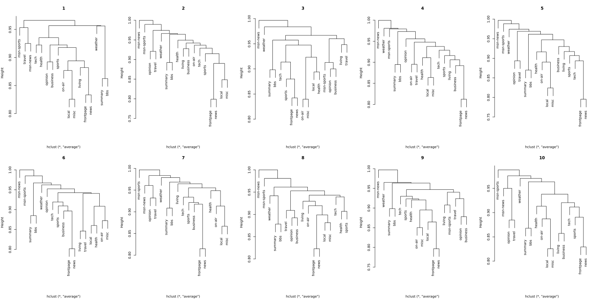

The data comes from Internet Information Server (IIS) logs for msnbc.com and news-related portions of msn.com for the entire day of September, 28, 1999 (Pacific Standard Time). Each sequence in the dataset corresponds to page views of a user during that twenty-four hour period. Each event in the sequence corresponds to a user's request for a page. Requests are not recorded at the finest level of detail---that is, at the level of URL, but rather, they are recorded at the level of page category (as determined by a site administrator). The categories are "frontpage", "news", "tech", "local", "opinion", "on-air", "misc", "weather", "health", "living", "business", "sports", "summary", "bbs" (bulletin board service), "travel", "msn- news", and "msn-sports". Any page requests served via a caching mechanism were not recorded in the server logs and, hence, not present in the data.

Create two R scripts `mapper.R` and `reducer.R`plus pre- and post-processing R code. The objective is to explore how the relationships among the page categories change over the course of the day. There are 17 page categories.

#### 1. Preprocess (and subset) the data by pushing a 1 into the first position of the first 1,000 observations out of the first 100,000 users, a 2 into the  first position out of the first 1,000 observations from the second 100,000 users, etc. for all 989,818 users. This results in 10 batches of 1,000 each with the batch number in the first position. These 10 values (1 to 10) will become the keys the the `mapper.R` code in the next item and represent a time index throughout the day.

```{r, eval=FALSE}
#### read in the data, skip the header info
msnbc.lines <- readLines("./MSNBC/msnbc990928.seq")[-(1:6)]

#### loop through the data, compute keys, write relevant rows to
#### output file
outfile <- file("msnbc_preprocessed.seq", "w")
invisible(sapply(seq_len(length(msnbc.lines)), function(i){
    mod <- (i %% 100000) - 1001
    if(mod < 0 & mod > -1001){
        key <- (i %/% 100000) + 1
        cat(key, ";", msnbc.lines[i], "\n", sep="", file=outfile)
    }
}))
#### finished up.  close the connection to the output file.
close(outfile)
```

`premsnbc.R` reads in the lines of `msnbc990928.seq` and subsets them
into our groups of 1000. The data is read in line-by-line and given an
index by row number.

Modulus arithmetic is used to determine to which subset, if any, the row
belongs. If the row does not belong to a subset it is discarded, 
otherwise it is assigned an integer key corresponding to its subset.

Rows that have been assigned keys are written to a new sequence file,
with their keys prepended. A semi-colon is used to delimit keys and
sequences such that each valid row is a 2-tuple of the form $(key; sequence)$.

#### 2. Develop the code for mapper.R. The key should be 1 for the first 1,000 observations (batch 1), 2 for the second 1,000 observatons (batch 2), etc. The value consists of the counts for each of the 17 page categories for each user-session. Note that the time order for each user-session is lost.

```{r, eval=FALSE}
## get the input
input <- file("stdin", "r")

## loop indefinitely since R lacks an EOF flag
while(TRUE){
    ## grab the current line
    current.line <- readLines(input, n=1)

    ## test to break loop.
    if(length(current.line) == 0) break

    ## split row into its label and counts
    tuple <- unlist(strsplit(current.line, ";"))

    ## grab the key
    key <- tuple[1]

    ## create an object to store counts for each category.  Add names
    ## so we can match categories and counts from the data
    count.vec <- numeric(17)
    names(count.vec) <- 1:17

    ## get counts by category
    current.counts <- table(strsplit(tuple[2], " "))

    ## match the names of the table values to the column names we
    ## set up and assign values accordingly.
    count.vec[names(current.counts)] <- current.counts

    ## Send the key and rows to the standard out.  Use semi-colon to
    ## delimit key and value,  commas to delimit counts.
    cat(paste(key, paste(count.vec, collapse=","), sep=";"), "\n")
}
close(input)
```

`mapper.R` opens a connection to standard input and reads line-by-line
to produce key-value pairs.

Each line is broken up into its key and sequence at the
semi-colon. The sequence is then tabulated and the counts stored in an
$1 \times 17$ vector. If a category does not appear in the sequence, a
count of zero is stored.

The keys and vector are sent to standard output using a semi-colon to
delimit the key and value and commas to delimit counts, giving us a
key-value pair of the form $(key; (x_1, x_2, \ldots, x_{17}))$.

#### 3. Develop the code for reducer.R. Create a `data.frame` for each batch. For each `data.frame`,  change all counts > 1 to 1. Compute the Jaccard distance matrix among the page categories. Note the Jaccard distance is $1 - J$ where $J$ is the Jaccard similarity. Vectorize the result as the return value (the length of the resulting vector will be $17 \times 16/2$). The key is the batch number.   
Hint: Tranpose the `0-1` matrix and multiply it by itself to get a $17 \times 17$ incidence matrix. Compute the Jaccard distanes from this matrix. Then do something like `yourMatrix[lower.tri(yourMatrix)]` to convert to a vector.

```{r, eval=FALSE}
#! /usr/bin/env Rscript

std.in <- file("stdin", "r")
prev.key <- ""
tmp <- tempfile(pattern = "msnbc_tmp", fileext = "csv")
tmp.handle <- file(tmp, "w")

## loop indefinitely (again, no EOF flag built in).
while(TRUE){
    ## get current line and test for zero-length
    current.line <- readLines(std.in, n=1)
    if(length(current.line) == 0) break

    ## split the observation up in to key and value
    tuple <- unlist(strsplit(current.line, ";"))
    current.key <- as.integer(tuple[1])
    current.val <- tuple[2]

    ## check if we've moved on to a new subset.
    ## Need the extra check for first key.
    if(!isTRUE(all.equal(current.key, prev.key))){
        if(prev.key != ""){
            ## we've finished writing to the key's temp file, so can it.
            close(tmp.handle)

            ## Note that for current.key = i, this code operates on i-1
            ## grab the written data set
            dat <- read.csv(tmp, header=FALSE)

            ## Process it.
            dat <- sapply(dat, function(r) ifelse(r == 0, 0, 1))
            xtx <- t(dat) %*% dat
            n.vec <- diag(xtx)
            dist.mat <- sapply(1:ncol(dat), function(i){
                sapply(1:ncol(dat), function(j){
                    1 - xtx[i,j]/sum(n.vec[c(i,j)], -xtx[i,j])
                })
            })
            result <- paste(dist.mat[lower.tri(dist.mat)], collapse=",")
            ## output results
            cat(prev.key, ";", result, "\n", sep="")
            ## prime the next go-round
            tmp.handle <- file(tmp, "w")
        }
        prev.key <- current.key
    }
    cat(current.val, "\n", file=tmp.handle, append=TRUE)
}

## process the final key.
close(tmp.handle)
dat <- read.csv(tmp, header=FALSE)
dat <- sapply(dat, function(r) ifelse(r == 0, 0, 1))
xtx <- t(dat) %*% dat
n.vec <- diag(xtx)
dist.mat <- sapply(1:ncol(dat), function(i){
    sapply(1:ncol(dat), function(j){
        1 - xtx[i,j]/sum(n.vec[c(i,j)], -xtx[i,j])
    })
})
result <- paste(dist.mat[lower.tri(dist.mat)], collapse=",")

## output results
cat(current.key, ";", result, "\n", sep="")

## clean up
unlink(tmp)
close(std.in)
```

As the key-value pairs from the mapper are read in by the reducer,
the keys and values are split. Until a new key is encountered, the
comma separated values are written line-by-line into a temporary .csv
file.

Once we encounter a new key, we read in the completed .csv from the
previous key and find the Jaccard distance matrix. We then output the
lower triangle of the distance matrix as a vector, along with its key,
to standard output for post-processing.

This process is repeated until the input has been exausted, at which
time we process and output the final part of the data set.


#### 4. Outside Hadoop, post-process the output from the reducer. For each batch reconstruct the Jaccard distance matrix and convert to a `dist` object, e.g., using `as.dist`. Cluster each of the 10 batches in order using the `average` method in `hclust`. Discuss the changes in the dendrograms over time.

```{r, eval=FALSE}
#### read in the data, split into a list of key-val pairs, and sort by
#### time of day
dist.lines <- readLines("./hw2-output/part-00000")
dist.split <- strsplit(dist.lines, ";")
keys <- sapply(dist.split, function(k) k[1])
dist.list <- lapply(1:length(keys), function(k) dist.split[[k]][2])
names(dist.list) <- keys
dist.list <- dist.list[c(2:10, 1)]

#### now we need to convert the list elements from vectors to distance
#### matrices and cluster them.
cluster.list <- lapply(dist.list, function(l){
    dist.mat <- matrix(0, nrow=17, ncol=17)
    dist.mat[lower.tri(diag(17))] <- as.numeric(unlist(
        strsplit(l, ",")))
    colnames(dist.mat) <- rownames(dist.mat) <- c(
        "frontpage", "news","tech", "local","opinion",
        "on-air","misc", "weather","health", "living", "business",
        "sports", "summary", "bbs", "travel", "msn-news",
        "msn-sports")  
    hclust(as.dist(dist.mat), "ave")
})

## create dendros.
svg("dendros.svg", width=20, height=10)
par(mfrow = c(2, 5))
invisible(sapply(1:length(cluster.list), function(i){
    plot(cluster.list[[i]], main=names(cluster.list)[i], xlab="")
}))
dev.off()
```

<a href = "dendros.svg" target="_blank">
    
</a>  

Across all time periods, the front page and news categories often
visited by in the same session. Some other categories tend to
consistently appear in pairs as well, such as local & miscellaneous
and summary & bulletin board services.

In the middle of the day (times 4-7) and at time 2, we tend to see more clusters being built up
branch-by-branch in long runs, while the beginning and end of day
clusters see more discrete, compact clusters.


#### 5. Develop the workflow for items 1 to 4 above with items 2 and 3 being run within HDFS/ Hadoop using Hadoop streaming based on the R scripts. If you cannot get the code to run with Hadoop then use UNIX pipes, with perhaps some loss in points.

I used a shell script to automate the workflow:

``` sh
#### perform preprocessing.  
echo "Preprocessing..."
Rscript premsnbc.R

#### clear the output both locally and in hdfs so hadoop doesn't
#### complain
echo -e "\nCleaning up old output..."
if [ -N hw2-output ] ; then
    rm -r hw2-output
fi
hdfs dfs -rm -r hw2-output

#### refresh the source files to make sure we're working with the most
#### up-to-date versions.
if [ -N msnbc_preprocessed.seq ] ; then
    echo -e "\nUpdating data file..."
    hdfs dfs -rm msnbc_preprocessed.seq
    hdfs dfs -put msnbc_preprocessed.seq
fi
if [ -N mapper.R ] ; then
    echo -e "\nUpdating mapper file..."
    hdfs dfs -rm mapper.R
    hdfs dfs -put mapper.R

fi
if [ -N reducer.R ] ; then
    echo -e "\nUpdating reducer file..."
    hdfs dfs -rm reducer.R
    hdfs dfs -put reducer.R
fi


#### run the hadoop job.
echo -e "\nStarting the hadoop job..."
hadoop jar /usr/lib/hadoop-mapreduce/hadoop-streaming-2.5.0-cdh5.3.2.jar \
  -files mapper.R,reducer.R \
  -input msnbc_preprocessed.seq \
  -output hw2-output \
  -mapper mapper.R \
  -reducer reducer.R \
  -numReduceTasks 1

#### create a local copy of hadoop output.
echo -e "\nCreating local copy of output..."
hdfs dfs -get hw2-output

#### postprocess & get dendros.
echo -e "\nPostprocessing..."
Rscript postmsnbc.R

echo -e "\nAll tasks complete."
```

Since we tend to see more distinct clusters at the beginning and end
of the day, it seems reasonable that during these times users are
looking for specific types of news. In contrast, we don't see very
much structure in the middle of the day, which may point toward users
clicking around when they're bored at work.

Certain types of pages form clusters more often that not, such as
Business, Sports, and tech. These clusters may be indicative of
the demographics of the users who favor them, so that information may
be worth obtaining.

Because of this, random article recommendations may be best in the
middle of the day, while more targeted recommendations of categories
within clusters may be warranted during non-business hours. 


**Note:** Your next assignment will redo this assignment using the `datadr` and `rhipe` packages from Tessera. This assignment uses Hadoop streaming.


