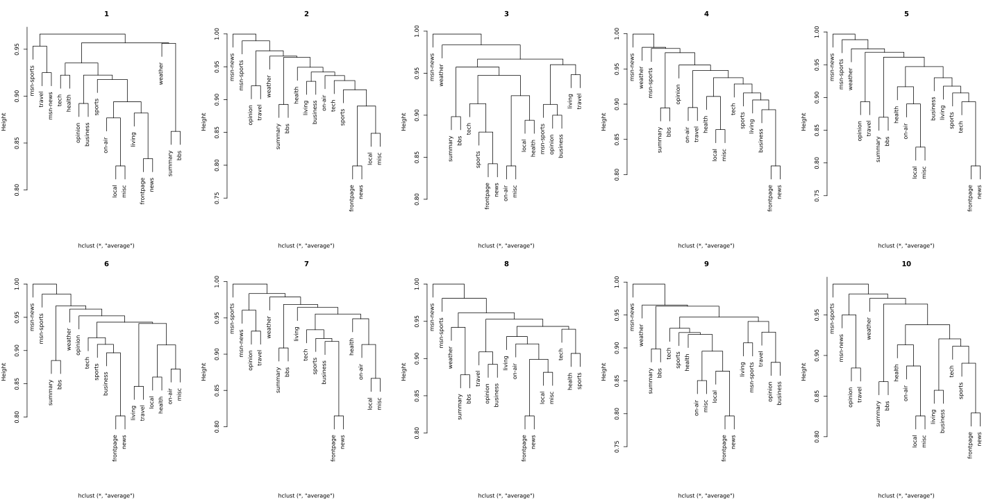

The data comes from Internet Information Server (IIS) logs for msnbc.com and news-related portions of msn.com for the entire day of September, 28, 1999 (Pacific Standard Time). Each sequence in the dataset corresponds to page views of a user during that twenty-four hour period. Each event in the sequence corresponds to a user's request for a page. Requests are not recorded at the finest level of detail---that is, at the level of URL, but rather, they are recorded at the level of page category (as determined by a site administrator). The categories are "frontpage", "news", "tech", "local", "opinion", "on-air", "misc", "weather", "health", "living", "business", "sports", "summary", "bbs" (bulletin board service), "travel", "msn- news", and "msn-sports". Any page requests served via a caching mechanism were not recorded in the server logs and, hence, not present in the data.

The objective is to explore how the relationships among the page categories change over the course of the day. There are 17 page categories.

#### 1. Using Vagrant, create a session directory called `msnbc` and copy `msnbc.txt` into this directory. Create an `msnbc` directory in HDFS and read the `msnbs.txt` file into this HDFS directory as a text file.

```{r, eval=FALSE}
library(datadr); library(Rhipe)
rhinit()
h.tmp.dir <- "/user/vagrant/tmp/msnbc"
local.msnbc <- "~/624/hw/assign3/msnbc_preprocessed.seq"
h.msnbc <- paste(h.tmp.dir, "msnbc_preprocessed.seq", sep="/")
h.conn <- hdfsConn(h.tmp.dir, autoYes = TRUE)
rhput(local.msnbc, h.tmp.dir)
```

Note that `msnbc_preprocessed.seq` is the results of preprocessing `msnbc.txt` so that it contains the subsets and keys as specified in assignment 2.  Each row is a key-value pair of the batch number and the sequence, delimited by a semi-colon.

#### 2. Write a `mapper` expression which codes the key be 1 for the first 1,000 observations out of the first 100,000 users (batch 1), 2 for the second 1,000 observatons from the second 100,000 users (batch 2), etc. for all 989,818 users. The `outputkey` consists of the character vector of length of 1 containing the batch number. The `outputvalue` consists of the counts for each of the 17 page categories collected together in a data frame for each user-session.

~~Note: Since a text file is read in, the `map.keys`  is 1 to 989,818 and these numbers can be used to create the batch `outputkey`. The corresponding `map.values` is the line containing the observational data. The can be used to generate the `outputvalue`, which is a `data.frame` with one row and 17 category variables.~~

```{r, eval=FALSE}
map <- expression({
  lapply(seq_along(map.keys), function(r){
    tuple <- unlist(strsplit(map.values[[r]], ";"))
    current.key <- tuple[1]
    current.counts <- table(strsplit(tuple[2], " "))
    current.val <- integer(17)
    current.val[as.integer(names(current.counts))] <- current.counts
    rhcollect(current.key, current.val)
  })
})
```

For every key-value pair in the source file, the data is split into its key and value.  An $1 \times 17$ zero vector is initialized, and the counts for each category assigned to their respective columns.  Each of these keys and vectors are collected to be processed in the reduce phase. 

#### 3. Develop the code for the `reducer` expression. The output key-value pairs of `mapper` are the input key-value pairs to `reducer`. Create a `data.frame` for each batch. For each `data.frame`,  change all counts > 1 to 1. Compute the Jaccard distance matrix among the page categories. Note the Jaccard distance is $1 - J$ where $J$ is the Jaccard similarity. Vectorize the result as the return value (the length of the resulting vector will be $17 \times 16/2$). The `reduceoutputkey` is the batch number. The `reduceoutputvalue` is the vectorized Jaccard distances.   

Hint: Tranpose the `0-1` matrix and multiply it by itself to get a $17 \times 17$ incidence matrix. Compute the Jaccard distanes from this matrix. Then do something like `yourMatrix[lower.tri(yourMatrix)]` to convert to a vector.

```{r, eval=FALSE}
reduce <- expression(
  pre = {
    dat <- data.frame()
  }, 
  reduce = {
    dat <- rbind(dat, do.call(rbind, reduce.values))
  },
  post = {
    dist.key <- reduce.key[1]
    dat <- ifelse(as.matrix(dat) == 0, 0, 1)
    xtx <- t(dat) %*% dat
    n.vec <- diag(xtx)
    dist.mat <- sapply(1:ncol(dat), function(i){
      sapply(1:ncol(dat), function(j){
          1 - xtx[i,j]/sum(n.vec[c(i,j)], -xtx[i,j])
      })
    })
    dist.vec <- dist.mat[lower.tri(dist.mat)]
    rhcollect(dist.key, dist.vec)
  }
)
```

For each map key, we start the reduce process by initializing an empty data frame.  Each vector from the map phase is added to the data frame as rows.  From here, we find the Jaccard Distances between the categories and output the lower triangle as a vector.

#### 4. Develop code for `rhwatch()`. The `input` is `msnbc.txt`, which is a text file. The `output` is a sequence file called `byBatch` which is put into the HDFS directory `msnbc`. Specify `readback = TRUE`.  Run `rhwatch()`.

```{r, eval=FALSE}
h.out <- paste(h.tmp.dir, "distances", sep="/")
foo <- rhwatch(
  map = map,
  reduce = reduce,
  input = rhfmt(h.msnbc, type="text"),
  output = rhfmt(h.out, type="sequence"),
  readback = TRUE
)
byBatch <- rhread(h.out, type="sequence")
save(byBatch, file="msnbc_distances_bin")
```

#### 5. Outside Hadoop, post-process the output from the reducer. For each batch reconstruct the Jaccard distance matrix and convert to a `dist` object, e.g., using `as.dist`. Cluster each of the 10 batches in order using the `average` method in `hclust`. Discuss the changes in the dendrograms over time.

```{r, eval=FALSE}
#### Read in byBatch from the binary file.
load("msnbc_distances_bin")

#### now we need to convert the list elements from vectors to distance
#### matrices and cluster them.
cluster.list <- lapply(byBatch, function(l){
    dist.mat <- matrix(0, nrow=17, ncol=17)
    dist.mat[lower.tri(diag(17))] <- l[[2]]
    colnames(dist.mat) <- rownames(dist.mat) <- c(
        "frontpage", "news","tech", "local","opinion",
        "on-air","misc", "weather","health", "living", "business",
        "sports", "summary", "bbs", "travel", "msn-news",
        "msn-sports")  
    hclust(as.dist(dist.mat), "ave")
})

## create dendros.
svg("dendros.svg", width=20, height=10)
par(mfrow = c(2, 5))
invisible(sapply(1:length(cluster.list), function(i){
    plot(cluster.list[[i]], main=byBatch[[i]][[1]], xlab="",
         ylim=c(0.75, 1))
}))
dev.off()
```

After running `rhwatch()`, the vector of distances for each batch was saved as an R binary file.  `postmsnbc.R` reads `byBatch` from this binary file, creates the `hclust` object for each batch, and saves the results as a list of `hclust` objects.

Each of these clusters is plotted plotted in a $2 \times 5$ grid of dendrograms so we can make side-by-side comparisons.

<a href = "dendros.svg" target="_blank">
    
</a>  

Across all time periods, the front page and news categories often
visited by in the same session. Some other categories tend to
consistently appear in pairs as well, such as local & miscellaneous
and summary & bulletin board services.

In the middle of the day (times 4-7) and at time 2, we tend to see more clusters being built up
branch-by-branch in long runs, while the beginning and end of day
clusters see more discrete, compact clusters.

Since we tend to see more distinct clusters at the beginning and end
of the day, it seems reasonable that during these times users are
looking for specific types of news. In contrast, we don't see very
much structure in the middle of the day, which may point toward users
clicking around when they're bored at work.

Certain types of pages form clusters more often that not, such as
Business, Sports, and tech. These clusters may be indicative of
the demographics of the users who favor them, so that information may
be worth obtaining.

Because of this, random article recommendations may be best in the
middle of the day, while more targeted recommendations of categories
within clusters may be warranted during non-business hours. 


